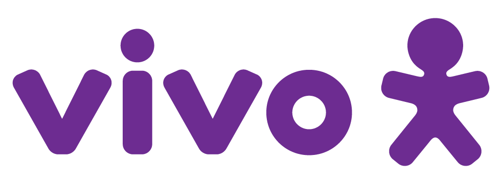

# Grupo Indra

    
    

## Projeto: Desenvolvendo uma aplicação escalável para otimizar o tempo de acesso às bases de dados legadas.

## Grupo: 4, Indra

## Integrantes
- [Diogo Pelaes Burgierman]()
- [Ever Felliphe Sousa da Costa](https://www.linkedin.com/in/ever-costa/)
- [Felipe Liberman Fuchs](https://www.linkedin.com/in/fuchsfelipel)
- [Gabriel Farias Alves](https://www.linkedin.com/in/gabriel-farias-alves/)
- [Gabriel Pelinsari Ribeiro](https://www.linkedin.com/in/gabriel-pelinsari/)
- [João Paulo da Silva](https://www.linkedin.com/in/jo%C3%A3o-paulo-da-silva-a45229215/)

## Descrição 
A Vivo, uma das maiores operadoras de telecomunicações do Brasil, enfrenta desafios significativos relacionados à sincronização de seu estoque entre sistemas on-premises (da SAP) e seu e-commerce. A falta de sincronização eficiente resulta em latência alta e problemas de desatualização de estoque, o que afeta diretamente a experiência do cliente e a operação como um todo. Com o aumento de usuários e a expansão do e-commerce, a escalabilidade do sistema também se torna uma preocupação crítica. Além disso, a falta de um fluxo de trabalho automatizado entre os sistemas agrava a sobrecarga manual e limita a agilidade da operação.

Para resolver esse problema, foi proposta uma arquitetura escalável utilizando a infraestrutura da AWS e integração robusta com o sistema SAP ECC. Em um mundo ideal, a solução como um todo envolve:

1. Infraestrutura em Nuvem (AWS):
- AWS DataSync foi implementado para sincronizar automaticamente os dados de estoque do SAP ECC on-premises para a nuvem, utilizando EFS para armazenamento seguro e redundante.
- A solução foi distribuída em múltiplas Availability Zones (AZs) da AWS para garantir alta disponibilidade e evitar single points of failure.
- Foi integrado um sistema de Auto Scaling para ajustar automaticamente os recursos de computação conforme a demanda.

2. Otimização de Performance:
- ElastiCache e CDN foram utilizados para reduzir a latência e melhorar a performance do sistema, especialmente em momentos de alta demanda.
- A arquitetura foi planejada para suportar picos de tráfego, com monitoramento contínuo e thresholds ajustados para otimização de recursos.

3. Gestão e Integração:
 - A integração entre o SAP ECC e o sistema e-commerce foi aprimorada com APIs documentadas e robustas, além de mecanismos para alertar sobre breaking changes.
- Documentação detalhada dos processos foi criada para facilitar o onboarding e a homogeneização do conhecimento entre as equipes da Vivo.

4. Escalabilidade e Atendimento:
- O uso de metodologias ágeis e capacitação de equipes de diferentes áreas foi implementado para lidar com a sobrecarga de demanda e garantir a agilidade no atendimento.
- No atendimento ao cliente, a introdução de inteligência artificial e bases de conhecimento (KBs) permite automatizar o suporte de nível 1, reduzindo a carga sobre o suporte especializado.

Essa abordagem, além de mitigar os riscos de latência, falhas e sobrecarga, permite uma maior escalabilidade e resiliência, garantindo que a Vivo possa atender a um número crescente de usuários sem comprometer a qualidade dos serviços. Neste projeto, implementamos a infraestrutura em nuvem e alguns quesitos de otimizacão e integração; contudo, se houvesse mais tempo, seria possível explorar de forma mais aprofundada os itens 2, 3 e 4.

# Configuração para Desenvolvimento
Para executar e desenvolver esta aplicação, é necessário ter instalado
- Python 3.11
- A versão mais recente do Go Lang
- Node.js 20.x.x
- CLI da AWS

# Licença

    
    

Este software é licenciado sobre a licença [Attribution 4.0 International](https://creativecommons.org/licenses/by/4.0/?ref=chooser-v1).

# Tags
- Sprint 1
    - Entendimento de Negócio
    - Entendimento do Usuário
    - MVP com deploy da aplicação com arquitetura básica
    - Requisitos Funcionais e Não Funcionais
- Sprint 2
    - Arquitetura Corporativa
    - Artigo (Versão 1)
    - Backend
    - Frontend
    - Infraestrutura
- Sprint 3
    - Artigo (Versão 2)
    - Integração frontend e backend
    - Modelagem
    - Relatório Técnico
- Sprint 4
    - Artigo (Versão 3)
    - Definição da Aplicação
    - Testes do Sistema
- Sprint 5
  - Aprimoramento dos Testes
  - Artigo Completo
  - Organização do repositório do GitHub