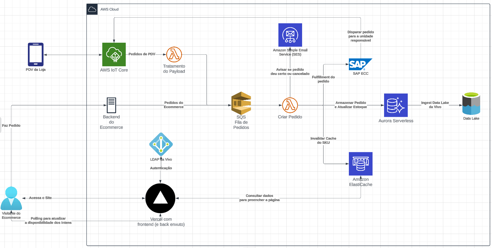
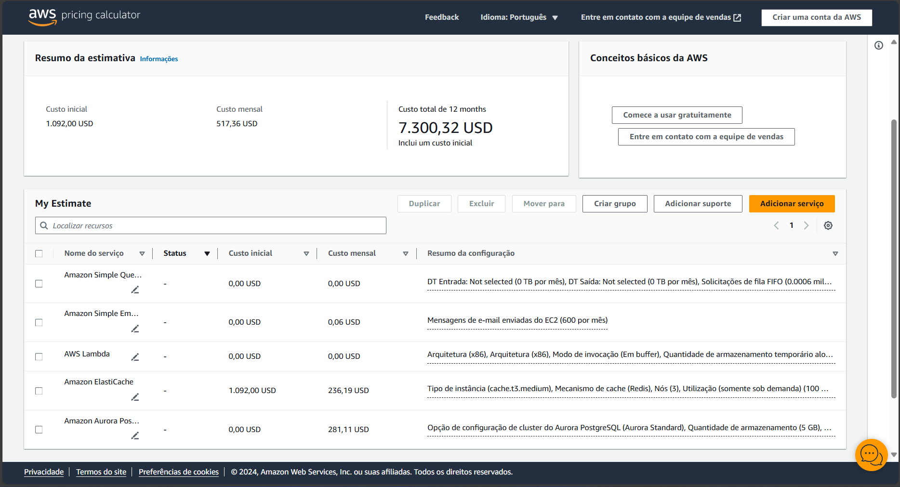

# Análise Financeira
O escopo deste projeto se limita a uma API de uso interno; portanto, a análise financeira se limitará a custos. Antes de implementar esta API em produção, seria interessante calcular a taxa de conversão do site, fazendo o mesmo cálculo após a atualização. Desta forma, faz-se possível estimar o impacto deste projeto na receito do e-commerce da Vivo.

## Despesas de AWS
Antes de mostrar a lógica por trás dos custos da AWS, é necessário entender os componentes da arquitetura disponíveis no diagrama abaixo:

Imagem 1. Diagrama da Arquitetura do projeto na AWS

Os componentes são:
- Dados
    - Aurora Serverless (base de dados compatível com Postgres)
    - ElastiCache
- Comunicação
    - SES (serviço de envio de email)
- Controle de Fluxo
    - SQS (Fila de Pedidos)
- Processamento
    - Lambda (funções serverless)

Além disso, assumimos a seguinte demanda:
- 95% do tempo o sistema está com demanda "normal", tendo 4 RPS (o dobro das 278 visitas/minutos identificadas pelo parceiro)
- 5% do tempo o sistema está com demanda "alta", tendo 80 RPS (o dobro das 2380 visitas/minuto identificadas pelo parceiro)

Vale notas que, de acordo com a arquitetura planejada, um visitante não fará mais do que uma consulta por minuto na API, uma vez que a entrega só precisa ser calculada com precisão no fechamento do pedido.

O único item que precisa ter 100 vezes mais capacidade em termos de RPS do que o especificado acima é o ElastiCache, onde cada visita gera inúmeras consultas. 

Vale notar que a quantidade de RPS estimadas foram pessimistas frente à realidade, o que torna esta análise financeira conservadora.

Abaixo, calcularemos as métricas que são utilizadas para dimensionar os custos de cada recurso enumerado anteriormente:

### ACUs do Aurora Serverless
Estimamos que a maior tabela da Base de Dados do Aurora não ultrapasse 1 GB. Desta forma, para o Aurora, estimamos os seguintes componentes de custo levando em conta que 2 GB de RAM são mais do que suficientes para as queries necessárias:
- 0.5 ACU, que é a capacidade mínima da AWS e tem aproximadamente 2 GB de RAM
- Aurora Serverless v2
- 5 GB de dados nos cluster
- 35 GB de backup

### Tamanho do Cache e Dados por Request
> O tamanho em KB das requests foi exagerado para cima, o número exato dependerá de benchmark após conclusão do projeto

Pela quantidade de produtos disponíveis, o tamanho da base de dados em cache não deve passar de 4 GB. Desta maneira, chegamos aos seguintes componentes de custo:
- 500 MB em Cache (usaremos 1 GB, que é o mínimo da AWS)
- Média de 7.8 RPS (95% x 4 RPS + 5% x 80 RPS)
- 10 KB por request
- 3 nodes t3.medium para ter alta disponibilidade
- Reserva de capacidade por 1 ano

### Pedidos por Mês (SES e SQS)
> Nota: ainda não temos o número da Vivo, estamos estimando o número de compras em 600 já que seria o resultado aproximado se levarmos em conta uma taxa de conversão de 10%. Esta seção será atualizada após recebermos os números oficiais.

A Vivo recebe 600 pedidos por mês, o que consome os recursos a seguir:
- SQS: 0.0006 milhões _FIFO Queue Requests_
- SES: 600 emails

### Lambda
> Tempo de Execução, Consumo de Memória e Storage são estimados, será necessário fazer benchmark após conclusão do projeto

Para calcular o consumo do AWS Lambda, precisamos entender os recursos que afetam o custo:
- 1200 invocações: 600 pedidos mensais, cada pedido invoca 2 funções
- 30.000 ms de tempo de execução por pedido 
- Arquitetura x86
- 128 MB de memória por execução (mínimo permitido pelo Lambda)
- 512 MB de Ephemeral Storage (mínimo permitido pelo Lambda)

### Custos de Rede
Os custos de rede são desprezíveis por trabalharmos com uma API, e não com distribuição de mídia ou qualquer outro tipo de serviço com alto consumo de banda.

### Resumo dos Números e Equivalência em Reais
Utilizando a calculadora da AWS com os parâmetros elaborados acima ([link aqui](https://calculator.aws/#/estimate?id=33cccd59321ed71ce0bd616bfb6fde3ff8090d97)), foram obtidos os seguintes custos:

Imagem 2: Screenshot da calculadora de custos da AWS

### Itens cujos custos não estão atrelados ao projeto
Os itens enumerados abaixo já existem e não devem ter alterações significativas em seus respectivos custos:
- LDAP da Vivo, utilizado para autenticar usuários na API;
- Backend do E-Commerce
- Sistemas do SAP
- Data Lake

## Outras Preocupações
Os gastos com nuvem são altamente impactados pela volatilidade do Dólar. Acreditamos que uma empresa como a Vivo já tenha isso planejado e que, perto do todo, o custo deste projeto seja baixo; toda via, é importante que o departmante financeiro esteja ciente disso para planejar a verba das áreas da empresa para o ano fiscal. 

## Despesas de DevOps
Para manter a infraestrutura funcionando com as devidas atualizações, estimamos que devem ser investidas 2 horas semanais de um membro pleno da equipe para supervisionas as tasks do membro júnior e se atentar a detalhes que impactam a elasticidade do sistema, e 4 horas semanais de um membro júnior para de fato fazer as alterações necessárias.