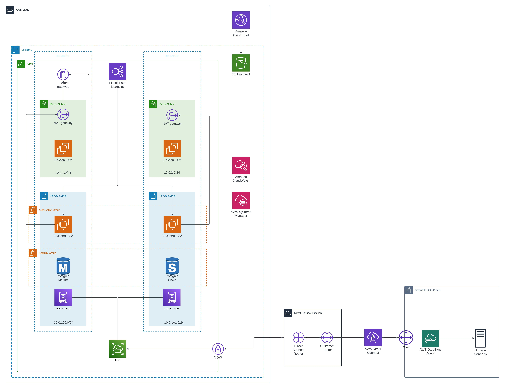

# Arquitetura da Solução
O objetivo deste documento é descrever a arquitetura da solução desenvolvida para a Vivo peloo grupo Indra. Apesar da maior parte do esforço de arquitetura estar na AWS, também foi necessário adicionar uma seção para o Data Center da Vivo, ou qualquer outra núvem: é necessário trazer os arquivos salvos localmente pelo SAP para a nuvem.

## Break-down da Arquitetura
### On-Premises
No datacenter da Vivo (ou Azure, onde estiver o SAP ECC), será instalado o AWS DataSync Agent. O objetivo dele é detectar modificações em um Servidor de Armazenamento genérico (usando NFS ou SMB) e enviar esses arquivos, de forma segura e privada, para um Elastic Filesystem (EFS) na AWS.

### Rede
O projeto inteiro está em uma única VPC; mas, para garantir alta disponibilidade, os servidores do projeto possuem réplicas em diferentes Availability Zones (AZ). Isso implica em cada AZ ter uma subrede própria, todas limitadas a uma máscara de subrede /24.

### Bastion
Os servidores Bastion server para permitir acesso seguro a partir de redes externas aos recursos de subredes privadas. Por ser um serviço de baixo uso, poderia-se até tolerar ter um único bastion; porém, se em algum evento a AZ onde o bastion estiver localizado ficar fora do ar, perdese acesso aos componentes da rede. Desta forma, faz-se necessário ter um bastion host por AZ.

Devido à demanda previsível e limitada dos Bastions hosts, optou-se por não colocá-los dentro de um Scale Group com Autoscaler.

### Backend
Todos os servidores do backend estão dentro de um Scale Group, que cria/remove instâncias do EC2 automaticamente a depender da demanda do serviço.

#### Sincronizador
Com os dados já salvos em uma EFS pelo AWS DataSync Agent, basta que o servidor do backend acesse os arquivos. Para fazer isso, é necessário criar um Mounting Point, que permite que o armazenamento do EFS estar montando em mais de uma subrede para acesso. Uma outra alternativa seria deixar o EFS dentro de uma única AZ, mas o SLA seria comprometido.

#### API (Fins de demonstração)
Nos mesmos servidores do backend, também será hospedada a API de acesso público. Para conectar a internet às subredes privadas, utilizam-se Load Balancers (ELB). Há 1 ELB por AZ, todos nas subredes públicas do mesmo.

### Frontend (fins de demonstração)'
Por fim, o backend construído em React será armazenado em um Bucket AWS S3. Para melhorar a latência dos clientes, optou-se por colocar uma CDN (AWS Cloudfront) entre o S3 e os visitantes: desta forma, os arquivos são distribuídos em vários POPs da AWS ao redor do mundo.

## Tradeoffs
Nesta sessão, descrevemos alguns tradeoffs que tiveram que ser tomados.

### Storage
A AWS tem várias soluções de Storage, algumas com mais performance do que as outras. Dado que será utilizado o AWS Lambda e o DataSync, as opções de storage são limitadas a 2 opções: S3 a EFS.

O EFS foi escolhido por permitir adicionar conteúdo a arquivos existentes (sem necessidade de overwrite) e pela redução de latência. Além disso, não são necessárias várias features do S3.

### RDS Availiability
Há 3 modos de se deployar uma base de dados RDS:
1. Multi-AZ DB Cluster
2. Multi-Az DB Instance
3. Single DB Instance

A opção 1 foi escolhida por ter 1 slave e 2 replicas, permitindo que os dados sejam lidos em qualquer AZ.

