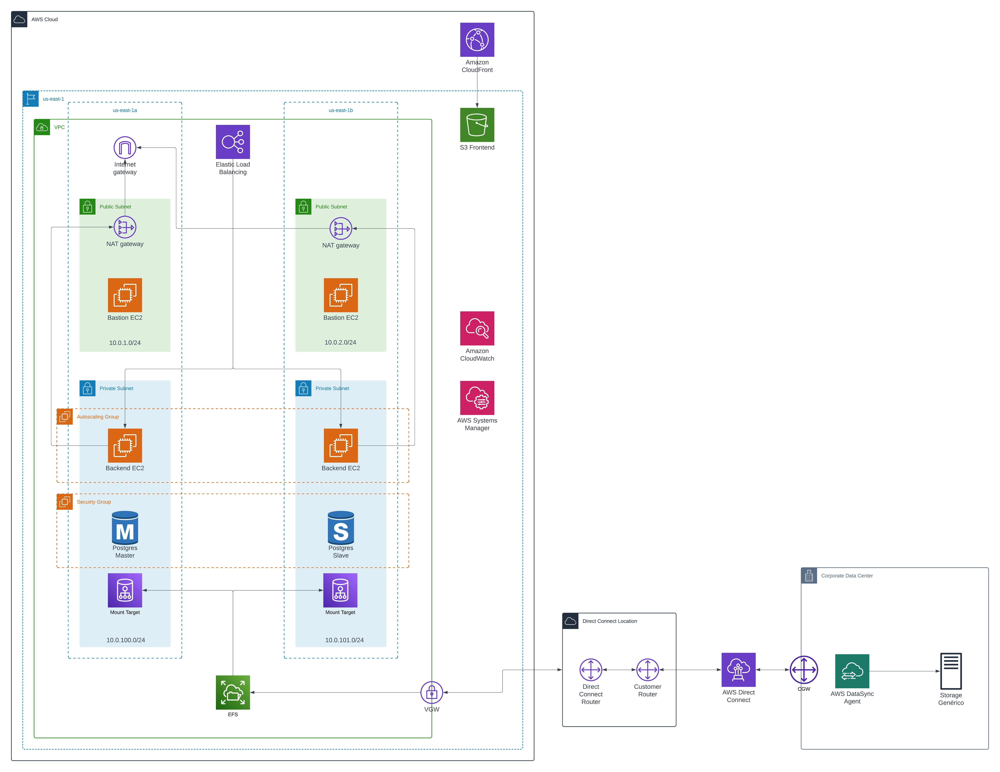
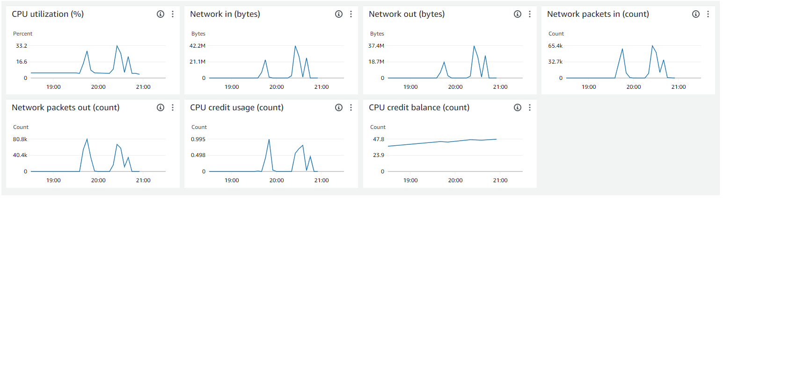

# Artigo

**Título**: Sincronização de sistemas de estoque on-premises e cloud em tempo real  
**Autores**: Diogo Pelaes Burgierman, Ever Felliphe Sousa da Costa, Felipe Liberman Fuchs, Gabriel Farias Alves, Gabriel Pelinsari Ribeiro, João Paulo da Silva

## Resumo

&emsp;&emsp;O artigo explora a problemática da falta de escalabilidade dos sistemas da VIVO para aguentar as altas taxas de requisições, assim como a dificuldade de sincronização em tempo real do estoque entre as lojas físicas e o _e-commerce_, ressaltando a complexidade de integração entre os dois sistemas. A solução proposta pelo projeto desenvolvido envolve a implementação de um sistema distribuído e escalável, aproveitando-se das vantagens da arquitetura em nuvem para garantir alta disponibilidade e baixa latência. O texto descreve como a integração do projeto aos sistemas de ERP da empresa e o _e-commerce_ proporciona mais eficiência e velocidade de sincronização, evitando situações como o cancelamento de compras, que podem causar frustração aos clientes. Além disso, detalha o uso da arquitetura em nuvem como um ponto essencial para a garantia da escalabilidade e do gerenciamento do grande volume de dados das diferentes lojas físicas, por meio do alinhamento entre os distintos serviços ofertados e do aproveitamento de suas vantagens. Assim, busca-se sanar as problemáticas apresentadas pelo parceiro, a fim de impulsionar a experiência do cliente, o que pode resultar em maior conversão de vendas e o aumento de lucros da VIVO.

## Introdução

No cenário atual de alta competitividade no comércio eletrônico, a gestão eficaz de estoques e a sincronização precisa de informações são elementos cruciais para garantir o sucesso de empresas que atuam com múltiplos centros de distribuição e lojas físicas. À medida que a demanda por eficiência operacional cresce, as falhas em manter o estoque atualizado em tempo real e a sobrecarga de plataformas de e-commerce se tornam desafios recorrentes, impactando diretamente a experiência do cliente.

Soluções existentes para esses desafios incluem o uso de infraestruturas em nuvem e sistemas distribuídos que oferecem escalabilidade e integração eficiente de dados. Fusaro et al. (2011) exploram o processamento de grandes volumes de dados na AWS, enfatizando a escalabilidade e eficiência em custos e tempo. Similarmente, Sukhoroslov et al. (2015) desenvolvem a plataforma Everest para execução distribuída de aplicações científicas, destacando a integração de recursos computacionais heterogêneos. Embora essas abordagens forneçam insights valiosos sobre escalabilidade e integração, elas não abordam diretamente a sincronização em tempo real de estoques com alta confiabilidade dos dados em ambientes de e-commerce.

No contexto da Vivo, uma empresa com 1.800 lojas físicas integradas ao seu sistema de e-commerce, a sincronização em tempo real dos estoques entre as lojas físicas e a plataforma online representa um desafio significativo. Problemas como atrasos na atualização de estoque e inconsistências de dados podem levar a cancelamentos de pedidos e insatisfação dos clientes. A empresa enfrenta dificuldades em manter a escalabilidade de seus sistemas para suportar altas taxas de requisições, além de integrar eficientemente os sistemas on-premises com a nuvem.

Diante desse cenário, este trabalho propõe uma solução estratégica para mitigar essas dificuldades por meio da utilização de uma infraestrutura escalável e de um sistema de inventário sincronizado, capaz de garantir alta disponibilidade, confiabilidade dos dados e visibilidade quase em tempo real. A proposta busca alinhar as necessidades do cliente — como a agilidade no processamento de pedidos e a garantia de disponibilidade de produtos — com os recursos oferecidos pela solução, como a sincronização automática e confiável dos estoques e a melhoria da experiência do cliente final.

A relevância deste estudo reside na possibilidade de aplicar tecnologias que maximizem a eficiência operacional, permitindo que o sistema suporte um maior volume de estoques sincronizados, além de melhorar o atendimento ao cliente, principalmente em um cenário com 1.800 lojas físicas integradas. Ao analisar essas questões, o artigo contribuirá para o desenvolvimento de uma solução robusta e escalável que atenda à demanda da Vivo, parceira do projeto.

## Trabalhos Relacionados

&emsp;&emsp;A sincronização de sistemas distribuídos, especialmente em cenários que envolvem a integração entre infraestrutura on-premises e nuvem, é um problema amplamente explorado na literatura acadêmica. A busca por soluções escaláveis, seguras e eficientes em termos de custo e tempo é um tema central. Nesta seção, discutimos três trabalhos que abordam desafios similares ao nosso e como suas abordagens podem ser relacionadas à nossa solução.

&emsp;&emsp;Fusaro et al. (2011) abordam o desafio de processar grandes volumes de dados na área de bioinformática utilizando a infraestrutura da AWS. O foco está na capacidade de escalar o processamento de dados conforme a demanda, com ênfase na eficiência em termos de custos e tempo. A tecnologia utilizada envolve o uso de instâncias elásticas da AWS para adaptar a infraestrutura em tempo real. Embora o estudo seja focado na bioinformática, a escalabilidade oferecida pelo uso da nuvem é altamente relevante para nossa solução, que precisa lidar com a variação constante de dados de estoque. No entanto, o estudo não explora questões específicas de sincronização em tempo real entre múltiplos sistemas.

&emsp;&emsp;Sukhoroslov et al. (2015) desenvolvem a plataforma Everest para publicação e execução de aplicações científicas em sistemas distribuídos, permitindo a integração de recursos computacionais heterogêneos de maneira eficiente. A solução proposta facilita a execução distribuída de tarefas em nuvem, destacando-se pela flexibilidade e pela escalabilidade proporcionada pela integração de diferentes recursos. A similaridade com nosso trabalho reside na necessidade de escalar e integrar múltiplos centros de distribuição e lojas físicas. No entanto, o estudo não aborda a sincronização de inventários ou a necessidade de baixa latência em transações de e-commerce.

&emsp;&emsp;Naseer (2023) examina a importância da segurança na implementação de soluções escaláveis em ambientes distribuídos. O estudo foca em práticas de segurança robustas e conformidade, elementos essenciais quando se lida com grandes volumes de dados distribuídos e sensíveis. Em nosso projeto, a segurança também é uma prioridade, visto que as informações de estoque e transações precisam ser protegidas em todas as camadas do sistema. O estudo, entretanto, não foca especificamente na sincronização de dados de sistemas on-premises com a nuvem.

&emsp;&emsp;Esses trabalhos fornecem uma base sólida para entender os principais desafios e soluções em ambientes distribuídos. Contudo, o nosso trabalho se diferencia ao focar especificamente na sincronização em tempo real de sistemas de estoque on-premises e cloud, garantindo baixa latência, alta disponibilidade e a integração entre múltiplas lojas físicas e centros de distribuição. Nossa abordagem busca resolver o problema da visibilidade e atualização de estoques em um ambiente com grande volume de transações, algo que não foi abordado de forma tão direta pelos trabalhos anteriores.

## 2. Materiais e Métodos

O desenvolvimento desta solução partiu de um entendimento profundo das necessidades de negócio da Vivo, uma empresa de grande porte com 1.800 lojas físicas integradas ao seu sistema de e-commerce. A sincronização em tempo real dos estoques entre as lojas físicas e a plataforma de e-commerce é um fator crucial para manter a eficiência operacional e evitar rupturas de estoque, especialmente em um ambiente que lida com grandes volumes de transações. A escalabilidade da aplicação é essencial, considerando o crescimento constante das operações e a variabilidade nas demandas de venda. Para o cliente final, isso garante a disponibilidade de produtos, agilidade no processamento de pedidos e entregas mais rápidas; para a empresa, reduz custos operacionais, como o frete, aumenta a eficiência e melhora a experiência do cliente final

<!-- ### 2.1 Contexto da solução -->

A imagem de arquitetura fornecida ilustra a interação entre três sistemas principais: SAP ECC, SAP E-commerce, e o projeto em desenvolvimento, que, por sua vez, é o foco deste artigo científico. O SAP ECC desempenha o papel crucial de atualizar uma pasta compartilhada com as informações de estoque provenientes de diversas lojas e centros de distribuição. Por outro lado, o SAP E-commerce é a plataforma que gerencia as vendas online, permitindo que os consumidores adquiram produtos de forma ágil e eficiente. Após a realização das compras, o SAP E-commerce sincroniza as informações de estoque com o SAP ECC, garantindo que os registros reflitam as transações mais recentes. O projeto, conforme detalhado neste artigo, visa desenvolver uma solução de inventário distribuído que integrará e otimizará esses processos, proporcionando maior confiabilidade, velocidade e visibilidade no gerenciamento de estoque, através da arquitetura apresentada na Figura 1. "Sistemas de inventário distribuído oferecem maior visibilidade e controle sobre o estoque em múltiplos locais, melhorando a precisão dos registros e reduzindo a incidência de problemas como rupturas de estoque ou superabastecimento. A integração com sistemas ERP e e-commerce é essencial para manter a sincronização em tempo real entre as vendas e o inventário disponível." (Zhou e Xu, 2022)

*Figura 1: Diagram de Arquitetura*

<!-- ### 2.2 Estrutura de Redes com Subrede Pública e Privada -->

A arquitetura de rede foi projetada utilizando os serviços da Amazon Web Services (AWS), destacando-se pela robustez e segurança. Implementou-se uma Virtual Private Cloud (VPC), contendo sub-redes públicas e privadas. As sub-redes públicas foram designadas para hospedar serviços que requerem acesso direto à internet, como o Application Load Balancer (ALB) e o Bastion Host, enquanto as sub-redes privadas abrigam instâncias de banco de dados e servidores de aplicação, que demandam maior nível de segurança.

<!-- ### 2.3 Acesso à Internet para Hosts Privados através de NAT Gateway -->

A aplicação escalável proposta deve não apenas garantir a alta disponibilidade do sistema, mas também otimizar os tempos de resposta e garantir a segurança dos dados transacionais. Para alcançar esses objetivos, o projeto se baseia em uma arquitetura distribuída que integra tecnologias de ponta, assegurando que a solução atenda aos requisitos técnicos e de negócio.

## 2.2 Arquitetura

A arquitetura da solução foi projetada para ser distribuída e escalável, garantindo que os sistemas de estoque on-premises e cloud se mantenham sincronizados em tempo real. Como ilustrado na **Figura 1**, a solução integra três sistemas principais: SAP ECC (que centraliza os dados de estoque), a plataforma SAP E-commerce (que gerencia as transações de venda online) e o novo sistema de inventário distribuído, desenvolvido especificamente para otimizar e automatizar a sincronização de dados entre as lojas físicas e a plataforma online.

Figura 1 - Diagrama de Arquitetura

## 2.3 Aplicação Escalável

Para implementar a escalabilidade, a arquitetura inclui um **Auto Scaling Group**, que automaticamente ajusta o número de instâncias EC2 com base na demanda. Isso permite que o sistema se adapte a picos de tráfego, como durante eventos promocionais ou grandes volumes de compras. O sistema de inventário distribuído é capaz de sincronizar dados entre as lojas físicas e a plataforma de e-commerce em tempo real, garantindo que o estoque disponível seja sempre atualizado conforme as vendas são realizadas.

Além disso, para garantir a eficiência na entrega de conteúdo, especialmente em regiões com alta demanda, foi implementada uma **Rede de Distribuição de Conteúdo (CDN)** utilizando o **AWS CloudFront**, que distribui conteúdo estático e dinâmico de forma eficiente.

## 2.4 Aplicação Web para Testar a Arquitetura

A fim de validar a solução e testar sua escalabilidade, foi desenvolvida uma aplicação web baseada em **Python (Flask)** para o backend e **React** para o frontend. Esta aplicação simula as operações críticas de sincronização de estoque e transações de compra entre o SAP ECC e o SAP E-commerce. O Flask permite a construção de uma API leve e flexível para manipular os dados de inventário, enquanto o React fornece uma interface de usuário dinâmica e responsiva.

O sistema foi configurado para executar sob uma infraestrutura gerenciada via **AWS EC2**, com backups automatizados e alta disponibilidade garantida por meio da configuração Multi-AZ do **AWS RDS** para os bancos de dados relacionais.

## 2.5 Testes de Carga

Para avaliar a eficácia da solução, serão realizados testes de carga utilizando ferramentas como **K6** e **AWS CloudWatch**. Os testes irão simular diferentes cenários de alta demanda para verificar a capacidade da aplicação de se ajustar automaticamente e continuar funcionando sem interrupções. Através desses testes, será possível identificar gargalos e ajustar a configuração do **Auto Scaling Group** e das sub-redes para garantir a melhor performance possível.

Além disso, serão realizados testes de segurança para garantir que a aplicação mantenha a integridade dos dados e esteja protegida contra ameaças comuns, como injeção de SQL e ataques DDoS, especialmente considerando a natureza sensível dos dados de inventário e transações financeiras.

## Resultados

Os testes de carga realizados com o uso da ferramenta K6 demonstraram que o sistema de e-commerce simulado foi capaz de lidar com a carga prevista, alcançando resultados satisfatórios tanto em termos de performance quanto de escalabilidade automática, utilizando o Auto Scaling Group da AWS.

### Execução dos Testes de Carga

Durante o teste de carga, foram gerados até 3.000 usuários virtuais (VUs) simultâneos, com um total de 37.444 requisições realizadas ao servidor e-commerce. Todas as requisições foram atendidas com sucesso, resultando em uma taxa de êxito de 100%, com status 200, confirmando que o sistema foi capaz de processar a carga sem apresentar erros ou falhas. O tempo médio de resposta das requisições HTTP foi de 10,96 ms, o que evidencia a eficiência do sistema em termos de tempo de processamento e atendimento de requisições, mesmo sob alta carga.

### Desempenho da Instância EC2 Inicial

*Figura 2: Gráficos do CloudWatch mostrando a utilização de CPU, tráfego de rede e utilização de créditos de CPU da instância EC2 inicial.*

A instância EC2 inicial apresentou um comportamento consistente em termos de utilização de CPU e tráfego de rede, como mostrado pelos gráficos do CloudWatch. A utilização de CPU atingiu um pico de 33,2%, indicando que o sistema foi capaz de gerenciar o processamento sem atingir limites críticos. A entrada e saída de tráfego de rede também foram monitoradas, com picos de 42,2 MB e 37,4 MB, respectivamente, mostrando que o sistema conseguiu lidar com a alta demanda de tráfego.

Além disso, o número de pacotes de rede gerados atingiu picos de 65,4k (entrada) e 80,8k (saída), indicando um volume significativo de dados sendo processados. Importante destacar que, ao atingir 30% de utilização da CPU, o Auto Scaling Group foi acionado, instanciando uma nova unidade EC2 para garantir a continuidade e eficiência no processamento da carga adicional.

### Comportamento do Load Balancer

*Figura 3: Gráficos do CloudWatch mostrando a utilização de CPU, tráfego de rede e utilização de créditos de CPU do Load Balancer.*

O Application Load Balancer (ALB) teve um papel fundamental na distribuição das requisições. A análise das métricas do Load Balancer revelou que o tempo de resposta teve picos de até 46,6 segundos, embora a maioria das requisições tenha sido processada em menos de 10 segundos. O número de requisições também variou, com picos de até 21,8k solicitações, refletindo a intermitência da carga durante o teste.

O balanceamento de carga ajustou eficientemente o tráfego entre as duas instâncias EC2, garantindo que ambas recebessem a carga de forma equilibrada, sem sobrecarregar uma única instância, o que confirma a eficiência do Auto Scaling aliado ao Load Balancer.

### Impacto no Fluxo de Operações da Empresa

A implementação da solução de inventário distribuído e o uso das tecnologias AWS impactaram diretamente o fluxo de operações da empresa, melhorando a eficiência e a confiabilidade do processo de sincronização de estoques. A sincronização quase em tempo real entre o SAP ECC e o SAP E-commerce resultou em maior precisão das informações de inventário, o que reduziu a ocorrência de problemas como rupturas de estoque e superabastecimento.

Essa maior visibilidade do estoque em múltiplos centros de distribuição e lojas permitiu otimizar a logística da empresa, possibilitando a entrega mais rápida a partir das lojas físicas mais próximas dos clientes, ao invés dos centros de distribuição mais distantes. Além disso, ao tirar a sobrecarga de processamento do sistema de e-commerce, a plataforma pôde focar em operações de venda, enquanto o inventário foi gerenciado de forma otimizada pelo sistema distribuído.

Do ponto de vista operacional, a escalabilidade automática proporcionada pelo Auto Scaling Group garantiu que a infraestrutura pudesse se ajustar dinamicamente às variações de carga, evitando tempos de inatividade e melhorando a experiência do usuário final, mesmo em períodos de pico de vendas. Com isso, a empresa foi capaz de manter um nível elevado de disponibilidade e performance sem a necessidade de provisionar recursos manualmente, o que reduziu custos operacionais.

### Sugestões para Futuros Testes e Iterações

1. **Exploração de Outros Serviços de Nuvem**:
   Embora o AWS tenha oferecido uma excelente infraestrutura para a implementação atual, é recomendável que futuros testes explorem outras plataformas de nuvem, como Google Cloud Platform (GCP) e Microsoft Azure, a fim de avaliar sua capacidade de lidar com cargas semelhantes e verificar eventuais vantagens em termos de custo, escalabilidade e integração com o ambiente corporativo já existente. Realizar comparações de desempenho entre diferentes provedores de nuvem também pode fornecer insights sobre qual plataforma oferece o melhor custo-benefício para as necessidades específicas da empresa.

2. **Integração de Machine Learning para Previsão de Demanda**:
   Um próximo passo relevante seria a implementação de algoritmos de aprendizado de máquina para prever a demanda de produtos com base em dados históricos de vendas e comportamento do usuário. Com essas previsões, o sistema de inventário poderia ser ajustado proativamente para garantir que os produtos mais procurados estejam sempre disponíveis, o que reduziria ainda mais o risco de rupturas de estoque e aumentaria a eficiência do sistema.

3. **Aprimoramento de Segurança e Compliance**:
   Considerando a crescente preocupação com a privacidade de dados e compliance em sistemas distribuídos, seria importante reforçar os testes de segurança, incluindo auditorias de conformidade com normas como GDPR e LGPD. Além disso, a implementação de camadas adicionais de criptografia e o uso de serviços de monitoramento de segurança em tempo real, como AWS GuardDuty, podem assegurar que o sistema esteja protegido contra ameaças cibernéticas, enquanto mantém a conformidade regulatória.

4. **Adoção de Estratégias Multi-Cloud**:
   Para garantir alta disponibilidade e resiliência contra falhas, a adoção de uma estratégia multi-cloud pode ser uma alternativa interessante para futuras iterações. Ao distribuir a infraestrutura entre múltiplos provedores de nuvem, a empresa pode reduzir o risco de falhas devido a problemas isolados em um único provedor, além de otimizar o desempenho regional para usuários geograficamente dispersos.

Em suma, esses próximos passos podem não apenas otimizar a performance e a segurança do sistema, mas também oferecer uma visão estratégica mais ampla para o futuro da empresa em um ambiente cada vez mais digitalizado e competitivo.

## Conclusão

Neste trabalho, propusemos uma solução robusta e escalável para a sincronização em tempo real de sistemas de estoque on-premises e cloud, atendendo às necessidades da Vivo e de empresas no geral que operam com múltiplos centros de distribuição e um grande número de lojas físicas integradas ao e-commerce. A arquitetura desenvolvida integra eficientemente simulações dos sistemas SAP ECC e SAP E-commerce com um novo sistema de inventário distribuído, utilizando tecnologias avançadas e serviços da AWS para garantir alta disponibilidade, baixa latência e segurança dos dados transacionais.

A implementação de um Auto Scaling Group e a utilização de uma Rede de Distribuição de Conteúdo (CDN) com o AWS CloudFront permitem criar uma infraestrutura capaz de se adaptar dinamicamente às variações de demanda, assegurando que o sistema possa lidar com picos de tráfego sem comprometer a performance ou a disponibilidade. A aplicação web desenvolvida, baseada em Python (Flask) e React, demonstrou a viabilidade da solução ao simular com sucesso as operações críticas de sincronização de estoque e transações de compra entre os sistemas.

Os testes de carga planejados, utilizando ferramentas como K6 e AWS CloudWatch, são fundamentais para validar a capacidade da aplicação de manter a eficiência operacional em cenários de alta demanda, identificando possíveis gargalos e permitindo ajustes na configuração do sistema. A preocupação com a segurança reforça a confiabilidade da solução, garantindo a integridade dos dados e a proteção contra ameaças cibernéticas.

Como resultado, a solução proposta tem o potencial de melhorar significativamente a experiência do cliente final, oferecendo informações precisas sobre a disponibilidade de produtos, agilizando o processamento de pedidos e reduzindo os tempos de entrega ao possibilitar que as entregas sejam realizadas a partir das lojas físicas mais próximas dos clientes. Além disso, contribui para a redução de custos operacionais e para o aumento da eficiência logística da empresa.

Para trabalhos futuros, sugerimos a exploração de métodos que possam aprimorar ainda mais a eficiência e a velocidade de atualização dos estoques. Isso inclui o refinamento dos protocolos de sincronização para reduzir a latência e aumentar a confiabilidade das transações entre os sistemas on-premises e a nuvem. Também é recomendada a expansão da solução para suportar integrações com outros sistemas legados ou de terceiros, bem como a adaptação para diferentes ambientes de nuvem híbrida, o que pode ampliar a aplicabilidade e o impacto da proposta em um cenário corporativo mais amplo. A realização de testes em ambientes de produção com cargas ainda maiores poderá fornecer insights valiosos para aperfeiçoar a escalabilidade e a robustez do sistema.

## Referências Bibliográficas

AMAZON WEB SERVICES. Amazon EC2 Auto Scaling. Disponível em: https://aws.amazon.com/pt/documentation/ec2/. Acesso em: 29 set. 2024.

ZHAO, X.; LI, M.; JIANG, Y. A comprehensive study on CDN performance: A survey. Journal of Network and Computer Applications, v. 134, p. 33-45, 2019.

ZHOU, Y.; XU, K. Distributed Inventory Management Systems: A Comprehensive Review. Journal of Supply Chain Management, v. 58, n. 3, p. 223-245, 2022.

RIMAL, B. P., JUKAN, A., KATSAROS, D., & GOELEVEN, Y. (2010). Architectural Requirements for Cloud Computing Systems: An Enterprise Cloud Approach. Springer Science+Business Media B.V., 2010.

MANGAYARKARASI, G. S., THAMIZHARASAN, S., CHITRA, K., KARPAGAM, J., & MURUGAN, S. (2021).Highly scalable and load balanced web server on AWS cloud . IOP Conference Series: Materials Science and Engineering, 1055, 012113. https://doi.org/10.1088/1757-899X/1055/1/012113

FUSARO, Vincent A. et al. Biomedical Cloud Computing With Amazon Web Services. PLOS Computational Biology, [S. l.], v. 7, n. 8, 2011. DOI: 10.1371/journal.pcbi.1002147. Disponível em: https://journals.plos.org/ploscompbiol/article?id=10.1371/journal.pcbi.1002147. Acesso em: 1 set. 2024.

SUKHOROSLOV, O; VOLKOV, S; AFANASIEV, A. A Web-based Platform for Publication and Distributed Execution of Computing Applications. In: 14th International Symposium on Parallel and Distributed Computing. Moscow: Institute for Information Transmission Problems of the Russian Academy of Sciences (Kharkevich Institute).

NASEER, I. AWS Cloud Computing Solutions: Optimizing Implementation for Businesses. Journal of Statistics, Computing and Interdisciplinary Research, v. 5, n. 2, p. 121-132, 2023. Disponível em: http://scir.wum.edu.pk/index.php/ojs. Acesso em: 1 set. 2024.
