## 1. Introdução

&emsp;&emsp;O presente projeto busca solucionar um problema significativo enfrentado pela Vivo, uma das maiores operadoras de telecomunicações do Brasil e parte integrante do Grupo Telefônica. A empresa enfrenta desafios na sincronização do gerenciamento de estoque, o que impacta negativamente a experiência do cliente e a eficiência das operações. Para aprofundar o entendimento das necessidades do parceiro e do problema a ser abordado, foi realizada uma imersão preliminar e uma pesquisa qualiquantitativa. Essas ações são essenciais para coletar dados críticos e informações necessárias ao desenvolvimento de uma solução eficaz.

&emsp;&emsp;Com essa abordagem inicial, buscamos esclarecer dúvidas sobre o projeto e identificar as principais barreiras enfrentadas pelos stakeholders. O objetivo é traçar estratégias eficientes para superar esses obstáculos, além de gerar insights valiosos que direcionem o trabalho, resultando em uma solução que atenda plenamente às necessidades identificadas.

## 2. Imersão Preliminar

&emsp;&emsp;A problemática central gira em torno da ausência de um sistema eficiente para a sincronização e gerenciamento de estoque, especialmente nos canais de e-commerce da Vivo. Atualmente, essa sincronização é realizada de forma manual e por meio de arquivos processados pelo sistema SAP Commerce Cloud, o que provoca alta latência para os usuários, reduzindo a satisfação do cliente e impactando negativamente as taxas de conversão de vendas.

&emsp;&emsp;A imersão preliminar foi realizada com o objetivo de mapear o entendimento inicial do problema. Foram utilizadas duas fontes principais: primeiro, o documento TAPI, que é o guia oficial do projeto fornecido pelo Inteli, oferecendo uma visão geral dos dados e do escopo do trabalho. Em segundo lugar, um workshop com os colaboradores da Vivo, no qual foram discutidos em detalhes os desafios enfrentados e respondidas as principais dúvidas relacionadas ao projeto. Essas ações permitiram à equipe definir um direcionamento claro para o desenvolvimento da solução.

&emsp;&emsp;Os principais pontos destacados pela Vivo incluem a necessidade de um sistema que ofereça escalabilidade para integrar mais lojas físicas ao sistema, além de alta velocidade para garantir uma experiência de usuário superior. A confiabilidade e a rastreabilidade também foram enfatizadas, sendo necessárias para garantir a confiança do cliente e a eficiência na entrega dos produtos. A utilização de dashboards para monitorar o desempenho do sistema em tempo real também foi mencionada como uma funcionalidade crítica.

&emsp;&emsp;Ao integrar esses requisitos no desenvolvimento do sistema, espera-se alcançar uma série de benefícios: redução de custos operacionais, aumento da disponibilidade de produtos nas lojas físicas e online, e uma maior taxa de conversão de clientes. A escalabilidade será suportada pela análise de dados de acessos e pela elasticidade do sistema, permitindo que a solução se adapte a picos de demanda, como durante a Black Friday.

&emsp;&emsp;A solução proposta deverá incluir o desenvolvimento de um sistema robusto na nuvem, capaz de suportar a expansão das operações da Vivo, além de simular as operações de e-commerce tanto no front-end quanto no back-end para garantir a qualidade do sistema. A principal persona identificada é o usuário final, e os benefícios para a logística e o e-commerce serão considerados como formas de agregar valor a esse usuário.

&emsp;&emsp;Para a parte técnica, foi sugerida a utilização de uma stack baseada na AWS, incluindo EC2 para virtualização da aplicação, RDS como banco de dados, S3 para armazenamento de arquivos, React e Node.js para desenvolvimento do front-end e back-end, respectivamente, e Grafana para visualização de dados. Essa combinação permitirá criar uma simulação fiel do ambiente de e-commerce, atendendo aos objetivos estabelecidos e superando os desafios identificados.

## 3. Pesquisa Qualiquant
> Nota: esta seção será atualizada para refletir novos resultados obitdos ao decorrer do módulo.
&emsp;&emsp;Para desenvolver o projeto com foco no usuário, é necessário compreender suas experiências e percepções ao utilizar plataformas de ecommerce, com ênfase nas situaçãoes de atraso na entrega e falta de sincronia de estoque. O objetivo prático desta pesquisa é mapear o perfil de usuários, indentificando como essas situações afetam suas decisões ao comprar online; com isso, serão identificados gargalos na experiência do usuário, ajudando este projeto a agregar valor ao parceiro através do aumento de taxa de conversão. 

&emsp;&emsp;A pesquisa foi enviada para dezenas de pessoas aleatoriamente escolhidas para evitar vieses. Após tratamento estatístico, os seguintes resultados foram obtidos:

### Dados demograficos

&emsp;&emsp;Aqui foram avaliadas questões demograficas, com o objetivo de ter uma noção mais geral sobre o público e as diferentes realidades e visões de diferentes localidades do Brasil. Estes dados podem ser cruzados com tempo de entrega e até mesmo a tolerância a latência para avaliar fenomenos especificos de cada região e faixa etária.

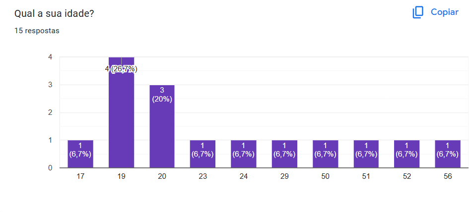
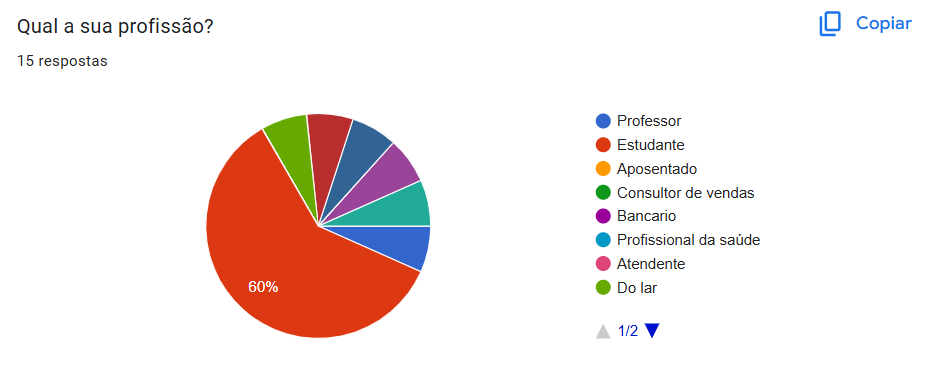
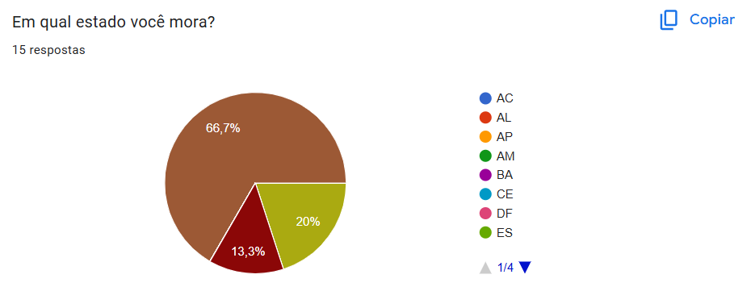

### Dados gerais sobre compras online
&emsp;&emsp;Nesta parte da pesquisa, foram avaliados os padrões de compra dos participantes e os fatores que os fazem desistir de uma compra. O objetivo é entender e mapear os e-comerces mais utilizados e obter uma visão mais calara acerca dos motivos para uma desistência de compra em âmbitos mais gerais.

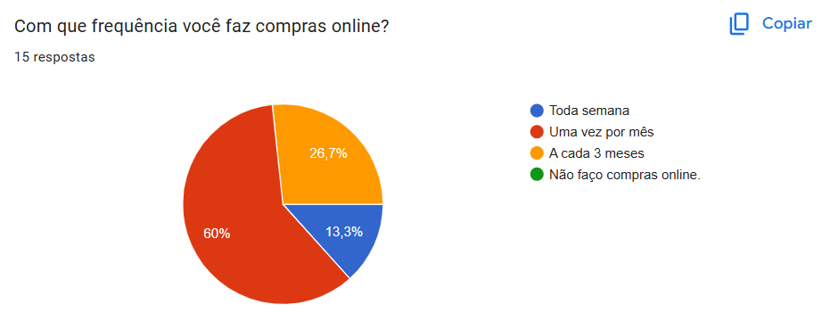
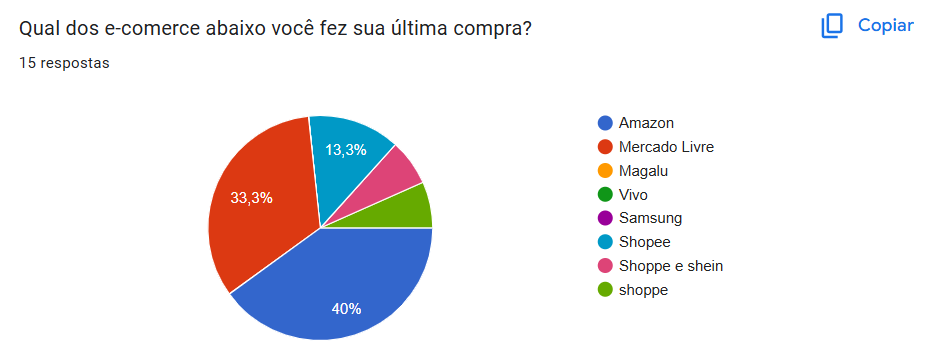
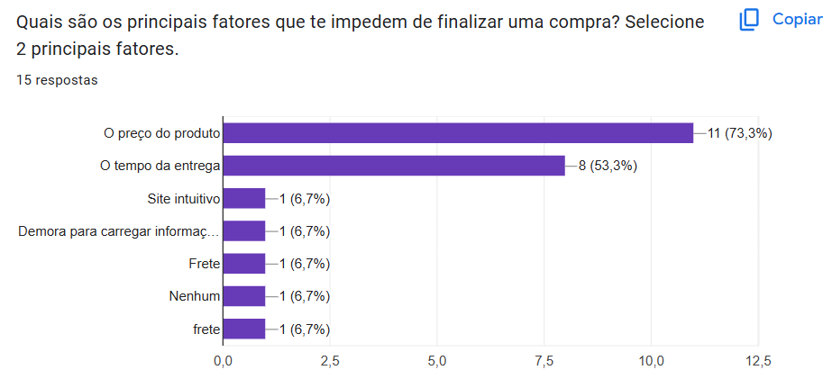

### Dados especificos sobre entrega e latência do site
&emsp;&emsp;para finalizar, nesta seção afunilamos para algo mais especifico como a latência, tempo de entrega e falta de sincronia no estoque(enunciado pelo caso ficticio apresentado na questão 9). O objetivo desta parte é entender como o usuario reage a situações como latência alta no site e qual a sua tolerância em relaçao ao tempo de entrega de produtos, latência de carregamento de informações e à falhas de sincronização de estoque.
#### Tempo de entrega
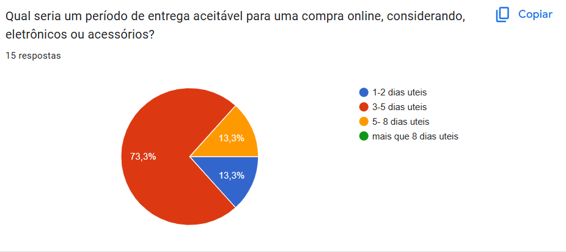
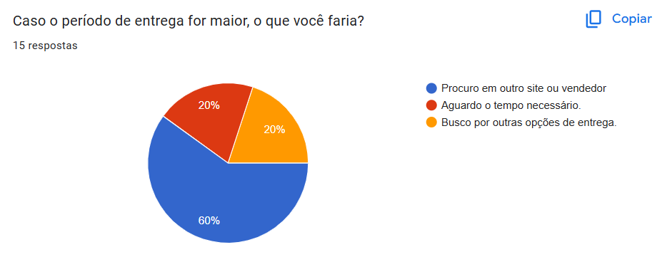
#### Falta de estoque
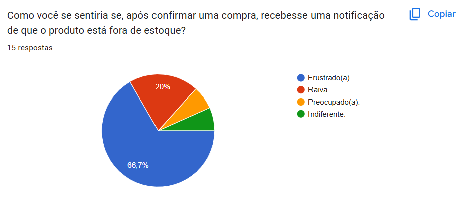
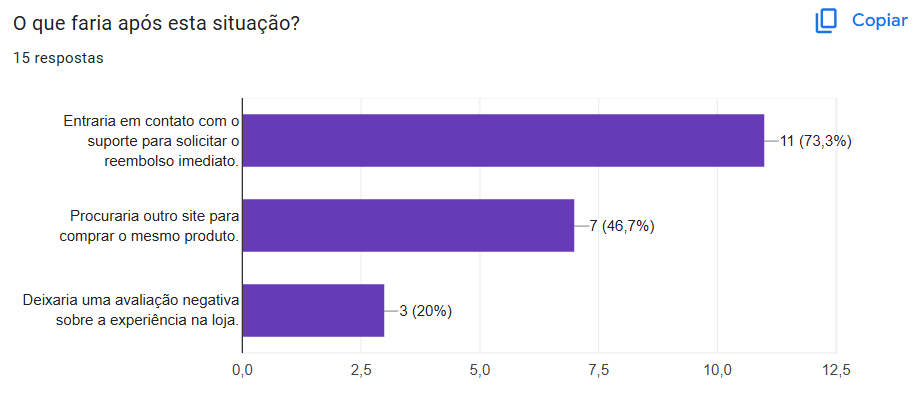
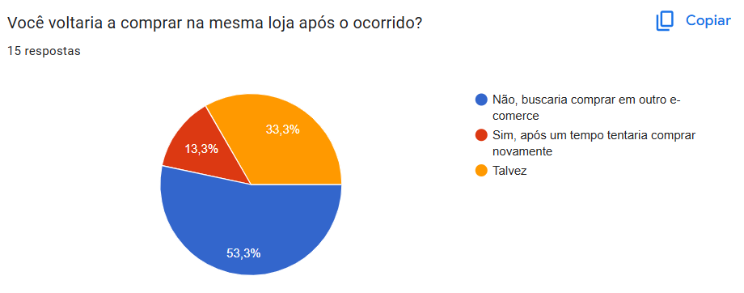
#### Latência no carregamento de informações
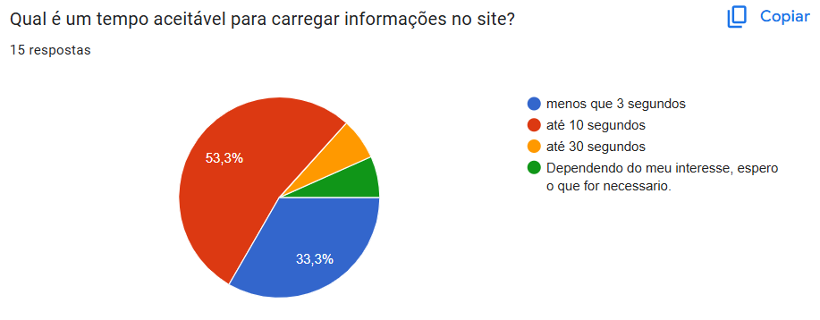
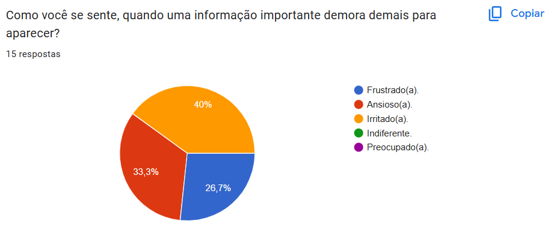
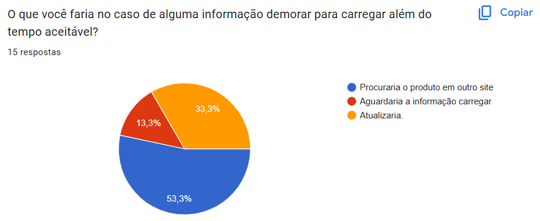
