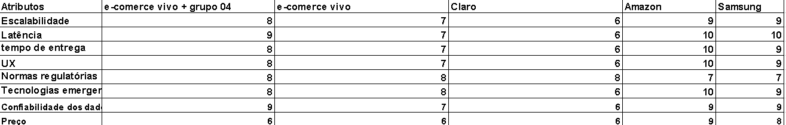
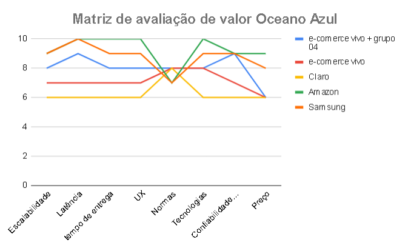
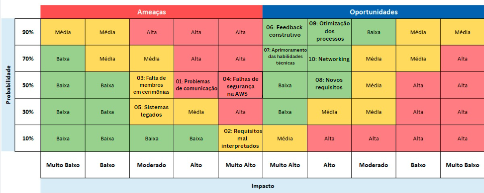
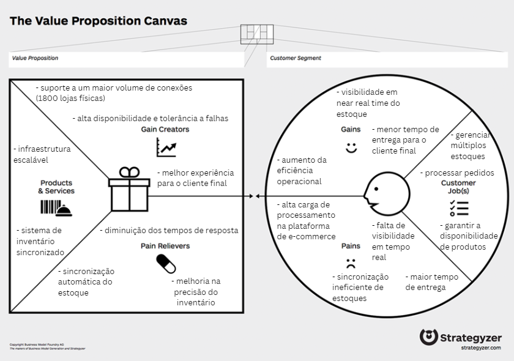

# Entendimento de negócio

## Matriz de Oeano Azul

&emsp;&emsp; A matriz de Oceano Azul é uma ferramenta que ajuda a identificar mercados inexplorados, chamados de oceanos azuis, evitando assim a criação de soluções ou estratégias já utilizadas em mercados saturados, conhecidos como oceanos vermelhos. Nessa matriz, são analisados diversos atributos de uma estratégia ou negócio em comparação com concorrentes de mercado, com o objetivo de reformular propostas de valor, tirando a solução de um oceano vermelho e levando-a para uma inovação, criando assim um oceano azul. Para isso, a matriz inclui quatro ações principais, cada uma com o papel de conduzir a análise para a identificação de oportunidades inexploradas. As quatro ações principais são:

 - Eliminar : Diz respeito a fatores do mercado em que o negócio está inserido, que podem ser eliminados por serem irrelevantes para o cliente final e por não gerarem valor.

 - Reduzir : Diz respeito a recursos ou processos que podem ser reduzidos e simplificados.

 - Aumentar : São fatores que podem ser elevados acima dos padrões, com o objetivo de entregar mais valor ao consumidor final.

 - Criar : São características ou recursos que nunca foram oferecidos pela indústria e que podem ser introduzidos como uma diferenciação, criando uma nova demanda no mercado.

&emsp;&emsp;No contexto da Vivo, temos uma empresa de telecomunicações que atua nas áreas de telefonia móvel, internet e na venda de celulares e acessórios. Neste projeto, estamos focando na frente de varejo, que abrange a venda desses periféricos e eletrônicos por meio de um e-commerce. Para realizar essa análise de Oceano Azul, precisamos comparar a Vivo nessa área de varejo com outros concorrentes do mesmo setor, levando em conta o contexto desse mercado e considerando a aplicação de sistemas distribuídos, além do problema relacionado ao estoque e sua sincronização. Foram escolhidos oito atributos para realizar a análise: escalabilidade, latência, tempo de entrega, satisfação do cliente, normas regulatórias, preço, tecnologias emergentes e comodidade. Abaixo seguem mais detalhes.

- Escalabilidade: Capacidade do serviço de suportar picos e se manter estável. No caso de um e-commerce, isso significa suportar picos de acesso e simular entregas sem apresentar quedas no serviço. Aqui, estaremos analisando a capacidade das aplicações de resistirem a eventos de pico de acesso.

- Latência: A latência é um fator de suma importância, pois afeta não apenas a experiência do usuário, mas também a taxa de conversão na plataforma, além de influenciar questões de SEO e a própria reputação da marca. Para a Vivo, uma latência baixa em seu e-commerce é decisiva para que o usuário complete todo o fluxo e efetive sua compra. Além disso, a baixa latência é crucial para a utilização de tecnologias emergentes, como chatbots e personalização em tempo real. Aqui, estaremos analisando a latência da plataforma na hora de processar os dados do usuário para recomendar ou informar um tempo de entrega. Além disso, também é importante garantir um bom tempo de resposta na plataforma como um todo.

- Tempo de entrega: O tempo de entrega é um fator decisivo na satisfação do cliente e influencia a fidelização e conversão. Aqui, estaremos analisando as diferenças entre os tempos de entrega indicados pelas plataformas como uma maneira de verificar a eficiência logística dessas empresas.

- UX: A experiência do usuário influencia tanto no fluxo de compra, desde a página principal até a conversão. Além de um design intuitivo nas páginas, é necessário garantir uma boa experiência no processo de entrega, desde a verificação do frete até o rastreamento da entrega e os feedbacks nesse processo. Este atributo pode impactar a fidelidade do usuário e a reputação da marca. Para nossa análise, focaremos no fluxo desde a escolha de um produto até a simulação de frete, para avaliar quão intuitivo é esse processo.

- Normas regulatórias: As normas regulatórias podem impactar a flexibilidade que a empresa tem para implementar soluções e novas tecnologias. Dependendo do setor, existem normas e regras que impedem certas ações, limitando assim todos os outros atributos. Neste contexto, iremos analisar as diferenças entre a regulamentação de cada empresa e como isso influencia a liberdade de inovação que a organização possui. No nosso caso, há um choque entre telecomunicações e varejo/e-commerce, que são mercados regulados de formas diferentes e com regras distintas.

- Preço:Os preços competitivos no mercado podem ser afetados por inúmeros fatores, desde a entrega até taxas e questões internas e estratégicas das empresas. No nosso caso, focaremos apenas na dimensão das entregas e sua relação com o custo final para o consumidor.

- Tecnologias emergentes:O uso de tecnologias emergentes, como IA e blockchain, ajuda a otimizar processos, reduzindo custos e aumentando a satisfação do cliente ao oferecer opções mais atrativas de produtos, como recomendações personalizadas. Além disso, essas tecnologias podem auxiliar na alocação inteligente de estoque, proporcionando entregas mais rápidas. Estaremos analisando especificamente a implantação de tecnologias com aplicação logística.

- Confiabilidade dos dados:A confiabilidade dos dados é crucial tanto para a implementação de tecnologias como IA quanto para a reputação da marca e a gestão de processos. No nosso caso, estaremos focando especificamente em dados logísticos, como estoque, onde essa confiabilidade é especialmente importante. Para nossa análise, iremos observar o quanto os dados de estoque e logística estão sincronizados e o quão confiáveis são, por exemplo, se refletem a realidade ou estão defasados.

&emsp;&emsp;Para realizar a avaliação, precisamos comparar a solução a ser desenvolvida com a existente da Vivo e com a de concorrentes. Para essa análise, foram escolhidas a Amazon, a Claro e a Samsung. Essas empresas foram selecionadas por serem varejistas ou por venderem smartphones e acessórios, como é o caso da Samsung e da Claro. Abaixo estão as quatro ações-chave do Oceano Azul e seus respectivos atributos que serão analisados.

- **Eliminar: Nenhum**

- **Reduzir:**
    - **Latência**:Um dos objetivos da nossa solução é reduzir a latência do serviço ao consultar o tempo de entrega e evitar a necessidade de acessar canais internos e lentos para obter essa informação. Para isso, será utilizada uma estrutura em nuvem para fornecer as informações de entrega de maneira mais rápida.
    - **Tempo de entrega**: A partir de um estoque mais sincronizado, espera-se que o tempo previsto de entrega para cada CEP seja reduzido. Com a solução desenvolvida, o sistema deverá ser capaz de identificar estoques em lojas próximas ao usuário e proporcionar um melhor tempo de entrega.

- **Aumentar:**
    - **Escalabilidae**: Devido à implementação de sistemas distribuídos e em nuvem, espera-se que a escalabilidade da aplicação aumente, suportando mais lojas registradas e atualizando diariamente seus estoques, além de lidar com picos de requisições para simular a entrega.
    - **UX**: À medida que o sistema de estoque fica mais sincronizado, espera-se que a experiência de simulação de frete melhore. Além disso, esse sistema pode impactar outros processos, como recomendações personalizadas com base no CEP do usuário. Em suma, a experiência deve melhorar à medida que esses processos se aprimorem.
    - **Confiabilidade de dados**:A partir de um sistema de estoque mais sincronizado com dados atualizados, espera-se que a confiabilidade dos dados referentes ao frete seja maior. Em comparação com o sistema atual, é esperado que não ocorram mais eventos como falta de estoque após a compra, além de reduzir drasticamente a presença de dados defasados, aumentando assim a confiabilidade deles.

- **Criar: Nenhum**

&emsp;&emsp;Abaixo está a tabela de avaliação de Oceano Azul com seu gráfico. Nela, analisamos as empresas Vivo, Claro, Amazon e Samsung, além da Vivo após a solução desenvolvida pelo Grupo 04 neste módulo.

&emsp;&emsp;Abaixo estão as justificativas para cada nota atribuída na tabela de avaliação:

 - Escalabilidade: A Vivo, em comparação com empresas globais e já estabelecidas em e-commerce, como Amazon e Samsung, recebe a nota 7, pois está iniciando na indústria do e-commerce. Ambas Amazon e Samsung têm nota 9. A solução a ser desenvolvida pelo Grupo 04 visa aumentar essa nota, pelo menos no quesito estoque, e com isso é esperada uma melhora. Assim, a junção da Vivo com a solução desenvolvida recebe a nota 8. A Claro possui nota 6 devido à sua estrutura atual e à dependência de parceiros.

- Latência:Em comparação com a Samsung e a Amazon, que têm uma infraestrutura otimizada e utilizam tecnologias emergentes em seus processos, a latência tende a ser menor. A Amazon e a Samsung recebem nota 10, enquanto a Vivo, que está entrando neste mercado, tem nota 7. A Claro possui nota 6 devido à menor automação de seus processos e à dependência de parceiros. Espera-se que, com a solução desenvolvida, a nota da Vivo aumente para 8, melhorando o tempo de resposta e o cálculo do tempo de frete.

- Tempo de entrega: A Amazon tem uma cadeia logística otimizada e é referência no quesito entrega, recebendo nota 10 para o tempo de entrega. A Samsung possui um sistema logístico robusto, mas pode enfrentar dificuldades de entrega em certas regiões, por isso sua nota é 9. A Vivo, que está expandindo para o e-commerce, ainda oferece um tempo de entrega consideravelmente longo, recebendo nota 7. Espera-se que, com a solução desenvolvida, essa nota suba para 8, com um tempo de entrega reduzido. A Claro, por outro lado, possui alta dependência de empresas logísticas terceirizadas e não foca em e-commerce de eletrônicos, resultando em uma nota de 6.

- UX: A UX da Amazon é excepcional devido às interfaces personalizadas com recomendações, seu fluxo intuitivo e checkout rápido com a opção de compra em um clique, resultando em nota 10. A Samsung também apresenta uma interface limpa e agradável, mas com alguma lentidão em momentos específicos, recebendo nota 9. A Vivo tem uma experiência sólida em seu e-commerce, mas ainda apresenta pontos de melhoria, como na confirmação de compra e nos quesitos de frete e rastreamento de produto, resultando em nota 7. Com a aplicação da solução desenvolvida, espera-se que a experiência do usuário melhore devido a um melhor tempo de entrega e maior confiabilidade nos dados informados ao usuário. A Claro recebeu nota 6 devido às inconsistências em sua plataforma de e-commerce, além de lentidão e falta de clareza na apresentação das informações.

- Normas regulatórias: Em comparação com o setor de varejo, as normas regulatórias em telecomunicações são mais rígidas. Assim, a Samsung e a Amazon recebem nota 7, enquanto a Claro e a Vivo recebem nota 8. Além disso, a nossa solução desenvolvida interfere neste quesito, mas a nota se mantém a mesma.

- Preço: Em comparação com concorrentes varejistas, os preços da Vivo e da Claro são mais altos, devido a políticas de preços menos agressivas e questões de eficiência operacional, resultando em nota 6 para ambas. Em contrapartida, a Amazon possui o preço mais competitivo, devido a políticas da empresa como promoções e descontos regulares, ganhando nota 9. A Samsung, embora não tenha uma cadeia otimizada como a Amazon, mantém um equilíbrio de preço e qualidade devido ao seu controle como fabricante, recebendo nota 8. A solução desenvolvida não afetará diretamente o preço, pois a Vivo não cobra o frete, mas pode impactar os custos operacionais ao longo do uso. Portanto, a nota permanece 6.

- Tecnologias emergentes: A Amazon é pioneira na implementação de tecnologias emergentes em sua cadeia logística para otimizar os processos, obtendo nota 10 nesse quesito. A Samsung também se destaca, mas devido a uma certa dependência de parceiros, recebeu nota 9. A Vivo, por estar iniciando neste mercado, tem nota 8. Com a solução desenvolvida, não se espera que esse cenário mude, pois o foco é escalar e sincronizar o estoque. A Claro, por outro lado, possui uma estrutura logística limitada no e-commerce, já que seu foco está em outra área, recebendo nota 6.

- Confiabilidade dos dados:Empresas como a Amazon e a Samsung, por serem globais e terem uma infraestrutura robusta e segura, possuem alta confiabilidade em seus dados, recebendo nota 9 para ambas. A Vivo, por estar iniciando no e-commerce, ainda não possui uma infraestrutura otimizada para essa finalidade, resultando em cenários de divergência de informações em suas operações, e recebeu nota 7. Com a solução desenvolvida, espera-se que a confiabilidade aumente, alcançando nota 9, especialmente no que diz respeito à sincronia de estoque. A Claro possui projetos para melhorar seu sistema, mas ainda enfrenta desafios e seu e-commerce não é o foco principal dos investimentos, resultando em nota 6.

&emsp;&emsp; De maneira geral, é possível observar que a solução a ser desenvolvida terá um impacto positivo na Vivo. Com a melhoria do sistema de estoque, a Vivo poderá se diferenciar de outras empresas de telecomunicações que estão no mercado de varejo. Além disso, será possível iniciar um movimento para se equiparar, em certos atributos, a players já estabelecidos como Amazon e Samsung.

## Matriz de riscos

Uma matriz de risco é uma ferramenta essencial no gerenciamento de projetos, utilizada para identificar, mapear e avaliar os riscos potenciais que podem afetar o sucesso do projeto. Ela é composta por uma tabela que cruza a probabilidade de ocorrência de cada risco com o seu impacto, classificando-os em categorias como muito baixo, baixo, moderado, alto e muito alto. Essa abordagem visual facilita a compreensão das áreas que necessitam de maior atenção e recursos, permitindo a implementação de estratégias eficazes de mitigação e controle. Ao utilizar uma matriz de risco, os gestores podem tomar decisões mais informadas e proativas, garantindo uma maior previsibilidade e resiliência frente às incertezas do projeto. Sendo pertinente lembrar também que a matriz é composta por duas partes, sendo a primeira os riscos negativos, ou ameaças, e a segunda os riscos positivos, que chamamos de oportunidades.

Na sequência, apresenta-se a matriz de risco elaborada pelo grupo e um detalhamento dos principais riscos identificados, bem como as estratégias de mitigação e justificativas para cada um deles.

### Ameaças

| #   | Ameaça                                                | Descrição                                                                                        | Plano de Ação                                                                                                        | Justificativa                                                                                               |
| --- | ----------------------------------------------------- | ------------------------------------------------------------------------------------------------ | -------------------------------------------------------------------------------------------------------------------- | ----------------------------------------------------------------------------------------------------------- |
| 01  | Problemas de comunicação entre os membros do grupo    | Falhas na troca de informações, levando a mal-entendidos e retrabalho.                           | Implementar ferramentas de comunicação eficientes (ex: Slack) e promover reuniões diárias de acompanhamento.         | Uma comunicação clara e eficaz reduz o risco de erros e aumenta a coesão do grupo.                          |
| 02  | Requisitos mal definidos ou incompletos               | Falta de clareza ou detalhes nos requisitos do projeto, causando desvios e entregas inadequadas. | Estabelecer reuniões regulares com os stakeholders para revisão e detalhamento dos requisitos.                       | Requisitos claros e completos são essenciais para o desenvolvimento correto e alinhado às expectativas.     |
| 03  | Falta de membros em cerimônias como planning e review | Ausência de membros do grupo nas cerimônias de planejamento e revisão, prejudicando o andamento. | Monitorar a presença e participação nas cerimônias e aplicar medidas corretivas em caso de ausência frequente.       | A participação ativa nas cerimônias é crucial para o alinhamento e progresso contínuo do projeto.           |
| 04  | Falhas de segurança na AWS                            | Configurações inadequadas na AWS que podem comprometer a segurança do projeto.                   | Manter uma comunicação próxima com professores experientes para orientação e revisão das configurações de segurança. | Garantir a segurança das configurações na AWS é vital para a proteção dos dados e do projeto.               |
| 05  | Complexidade de integração com sistemas legados       | Dificuldade em integrar o novo sistema com os sistemas legados existentes.                       | Realizar uma análise detalhada dos sistemas legados e desenvolver um plano de integração passo a passo.              | A integração bem-sucedida com sistemas legados é crucial para a funcionalidade e aceitação do novo sistema. |

### Oportunidades

| #   | Oportunidade                                                                   | Descrição                                                                                    | Plano de Ação                                                                                                    | Justificativa                                                                                               |
| --- | ------------------------------------------------------------------------------ | -------------------------------------------------------------------------------------------- | ---------------------------------------------------------------------------------------------------------------- | ----------------------------------------------------------------------------------------------------------- |
| 06  | Feedback contínuo e construtivo do parceiro                                    | Receber feedback regular e detalhado do parceiro sobre o andamento e entregas do projeto.    | Estabelecer reuniões de feedback a cada sprint (duas semanas) com o parceiro.                                    | O feedback contínuo permite ajustes rápidos e melhorias no projeto, alinhando as expectativas do parceiro.  |
| 07  | Aprimoramento das habilidades técnicas dos membros do grupo                    | Desenvolvimento e melhoria das habilidades técnicas individuais através da prática e estudo. | Incentivar a participação em workshops, cursos online e sessões de treinamento interno.                          | O aprimoramento contínuo das habilidades técnicas aumenta a qualidade das entregas e a eficiência do grupo. |
| 08  | Descoberta de novos requisitos que agregam valor ao projeto                    | Identificação de funcionalidades adicionais ou melhorias que beneficiam o projeto.           | Realizar sessões de brainstorming e manter comunicação aberta com stakeholders para capturar novas necessidades. | A incorporação de novos requisitos pode diferenciar o projeto e aumentar sua relevância e utilidade.        |
| 09  | Otimização dos processos de desenvolvimento através de retrospectivas eficazes | Analisar e melhorar os processos de trabalho através de revisões regulares das iterações.    | Conduzir reuniões de retrospectiva ao final de cada sprint e implementar as melhorias identificadas.             | A otimização contínua dos processos de desenvolvimento melhora a eficiência e a qualidade do trabalho.      |
| 10  | Construção de networking para futuros projetos e parcerias                     | Estabelecimento de contatos e relacionamentos profissionais valiosos para o futuro.          | Participar de eventos, conferências e manter uma comunicação ativa com stakeholders e parceiros.                 | O networking abre portas para novas oportunidades de projetos e colaborações no futuro.                     |

## Canvas de Proposta de Valor

O Canvas de Proposta de Valor é uma ferramenta de gestão estratégica que auxilia no desenvolvimento e alinhamento da proposta de valor de um produto ou serviço com as necessidades específicas dos clientes. Ele oferece um mapa visual que, de um lado, explora o perfil do cliente — identificando suas tarefas, dores e ganhos — e, de outro, descreve como a proposta de valor do produto ou serviço pode aliviar essas dores e gerar benefícios concretos. Essa abordagem permite que as empresas criem ofertas que realmente atendem às expectativas dos clientes, aprimorando a eficácia das suas estratégias de mercado.

A seguir, apresenta-se o canvas elaborado pelo grupo e um detalhamento dos principais tópicos:

Na sequência, são apresentados os principais elementos do Canvas de Proposta de Valor, com uma descrição detalhada de cada um deles:

#### Tarefas - Customer Jobs

-   Gerenciamento de estoque de múltiplos centros de distribuição e lojas: Monitorar e controlar os níveis de estoque em diferentes locais de forma eficiente.
-   Garantir a disponibilidade de produtos: Assegurar que os produtos estejam sempre disponíveis para os clientes, evitando falhas de estoque.
-   Processar pedidos de maneira eficiente: Realizar o processamento de pedidos de forma rápida e precisa, garantindo a satisfação do cliente.

#### Dores - Pains

-   Alta carga de processamento na plataforma de e-commerce: A elevada quantidade de transações pode sobrecarregar o sistema, resultando em lentidão e possíveis falhas. O que impossibilita a expansão para as 1.800 lojas físicas.
-   Sincronização ineficiente de estoques: Dificuldades em manter os níveis de estoque atualizados em tempo real, o que pode levar a inconsistências e erros.
-   Falta de visibilidade em tempo real: A ausência de informações atualizadas sobre o estoque dificulta a tomada de decisões e o planejamento logístico.
-   Maior tempo de entrega em alguns casos: Problemas de sincronização e visibilidade podem resultar em atrasos na entrega, impactando negativamente a experiência do cliente em momentos em que a entrega a partir de uma loja física iria reduzir o prazo.

#### Ganhos - Gains

-   Aumento da eficiência operacional: Melhoria no desempenho das operações, reduzindo custos e otimizando o uso de recursos, já que em muitos casos as entregas poderão ser feitas a partir de pontos mais próximos ao cliente.
-   Visibilidade em near real-time do estoque: Acesso quase imediato a informações atualizadas sobre o estoque, permitindo respostas mais rápidas e decisões mais informadas de onde será feita a entrega.
-   Menor tempo de entrega para o cliente final: Com a otimização do processo logístico, os clientes recebem seus pedidos mais rapidamente, partindo de lojas físicas, principalmente em destinatários em áreas distantes dos centros de distribuição.

#### Aliviadores de dor - Pain Relievers

-   Sincronização automática e confiável do estoque: Implementação de um sistema que mantém os níveis de estoque sempre sincronizados entre os pontos de armazenamento (lojas e centro de distribuição).
-   Melhoria na precisão do inventário: Utilização de tecnologias que garantem a acuracidade dos dados de inventário, reduzindo os tempos de entrega e evitando falhas.
-   Diminuição dos tempos de resposta: Sistemas otimizados que permitem uma resposta rápida às demandas do mercado e dos clientes.

#### Criadores de Ganho - Gain Creators

-   Suporte a um maior volume de estoques sincronizados (1800 lojas físicas): Capacidade do sistema de operar eficientemente mesmo com um grande número de lojas sincronizadas.
-   Alta disponibilidade e tolerância a falhas: Garantia de que o sistema permanecerá operacional e disponível, mesmo em caso de falhas ou picos de demanda.
-   Melhor experiência para o cliente final: Ao combinar eficiência operacional e alta disponibilidade, o cliente final desfruta de melhores previsões de entrega, consequentemente aumentando o número de pedidos.

#### Produtos e Serviços - Products & Services

-   Infraestrutura escalável: Um sistema capaz de crescer conforme necessário, suportando um aumento na carga de trabalho sem perda de desempenho.
-   Sistema de inventário sincronizado: Uma solução que garante a atualização constante e precisa dos níveis de estoque, integrando diferentes pontos de venda e centros de distribuição.
