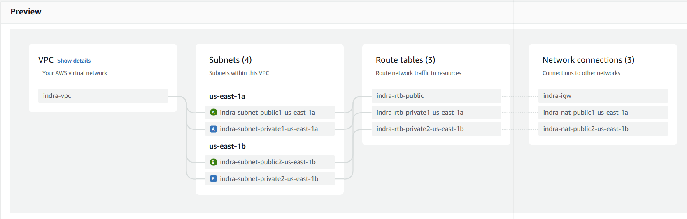
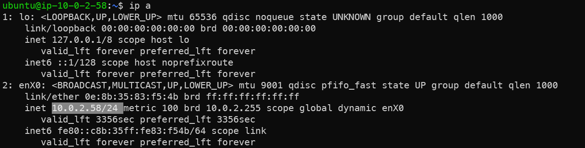

# Infraestrutura
Este documento demonstra como foi criada a Infraestrutura na AWS. [Clique aqui](https://drive.google.com/file/d/1ejz9K7546fPLLh3fFj2HwWnAwlVRISu0/view?usp=sharing) para ver a infraestrutura funcionando na AWS.


Nas seções abaixo há um passo-a-passo da criação de infraestrutura de rede, bastions e backend.
> A parte de backend ainda não está com as instruções completas.

## Passo 1. VPC
Antes de começar, é necessário criar uma VPC para conter a maior parte dos componentes descritos na [arquitetura](arquitetura-corporativa.md). Para fazer isso, é necessário acessar o AWS Console > VPC > Criar. As configurações são:
- Usar a quantidade de AZs, NAT Gateways e Endereços IP descritos na arquitetura
- Desabilitar VPC Endpoint de S3, já que nenhum recurso da VPC utiliza a S3

A VPC criada seguirá o diagrama abaixo:

Figura 1: Diagrama de criação da VPC


## Passo 2. Bastion Hosts
Um Bastion host nada mais é do que uma VM com acesso à rede privada. Os bastions são deployados nas Subredes Públicas de cada AZ sendo que, para deployá-los de acordo com o diagrama de arquitetura, basta: Abrir AWS Console > EC2 > Criar com as especificações abaixo:
- Um com nome `bastion-us-east-1a` e outro com nome `bastion-us-east-1b`
- Escolher OS Ubuntu
- Tamanho t2.micro
- Escolha a VPC criada anteriormente
- Colocar cada bastion em sua AZ, seguindo seus respectivos nomes
- Habilite a opção "Auto-assign Public IP"
- Ao criar o primeiro bastion, crie um Security Group (NSG) chamado `nsg-bastion`. Ao criar o seundo bastion, utilize o mesmo NSG.
- Permita ingresso SSH (porta TCP 22) do seu endereço IP

Para concluir, acesse ambos os bastions por um computador em rede externa para garantir que estào funcionando.

No caso dos servidores criados anteriormente:
```sh
# US East 1A
ssh -i .\indra-bastions.pem ubuntu@54.221.110.151

# US East 1B
ssh -i .\indra-bastions.pem ubuntu@34.226.199.122
```

Ainda, para garantir que as instâncias EC2 estejam nas subredes privadas, execute o comando `ip a` e verifique as mesma possuem endereços IPs privados pertencentes às subredes criadas.

Figura 2: Capura de tela demonstrando que o bastion-us-east-1b está na subrede apropriada


## Passo 3. VMs do Backend

O backend possui um deploy mais complexo por ter elasticidade de recursos. Abaixo, seguem as distintas etapas envolvidas nisso:
### A. Criar a AMI do Backend
> Nota: esta etapa ainda está sendo feita, então as intruções não estão 100% condizentes com o que está na AWS. Na próxima sprint isso será ajustado.

As instâncias do EC2 do backend ficarão em um autoscaler, o que implica em criar e destruir máquinas conforme necessário. Para criar as máquinas já configuradas, faz-se necessário ter um Launch Template com as especificações e imagem (AMI) da máquina.

O primeiro passo é configurar um EC2 manualmente e salvá-lo como imagem:
1. Crie um EC2 com Ubuntu em uma subrede privada, sem IP público. Crie um novo NSG chamado `nsg-backend`, liberando SSH a partir de IPs locais
2. Conecte-se ao bastion via SSH
3. Do bastion, conecte-se ao EC2 criado SSH
4. Execute os comandos abaixo:

```sh
sudo apt update && sudo apt upgrade -y
sudo add-apt-repository ppa:deadsnakes/ppa
sudo apt install python3.11 python3-pip
mkdir ~/indra
```

Depois, copie o script abaixo para `~/.indra-setup.sh` e execute `chmod +x ~/.indra-setup.sh`:

```sh
```

Feito isso, configure o Crontab para executar este script sempre que o servidor rebootar:
```sh
crontab -e
@reboot  /home/ubuntu/.indra-setup.sh
```

> Nota: a frase abaixo está muito vaga, será detalhada na próxima sprint.
Depois, grave uma AMI a partir desta máquina.

### B. Criar Launch Template
1. Em AWS Console > EC2 > Launch Templates clique em "Create"
2. Dê um nome para o template e clique para habilitar "Auto Scaling Guidance"
3. Configure uma chave SSH padrão para todas as instâncias
4. Escolha o Network Security Group criado na etapa anterior

### C. Criação do Auto Scaling Group
1. Abra AWS Console > EC2 > Auto Scaling Groups e clique em "Create"
2. Selecione o Launch Template criado na etapa anterior
3. Configure as instâncias para terem entre 0.5 e 8 vCPUs e 2 GB e 16 GB de RAM
4. Escolha a VPC correta e as subredes privadas
5. Crie um novo load balancer camada de aplicação que seja internet-facing. Para cada AZ, selecione a subrede pública.
6. Nas configurações de escalabilidade, deixe um mínimo de 3 instâncias e máximo de 90, com autoscale a partir de 75% de uso de vCPU ou memória, priorizando disponibilidade.

