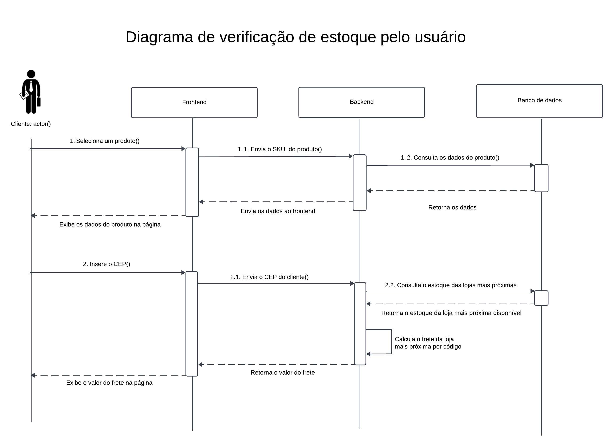

# 2. Diagrama de Sequência

&emsp;&emsp;O diagrama de sequência é um diagrama de interação que modela as ações dos atores ao utilizar o sistema, evidenciando suas interações com os componentes da aplicação, seguindo o padrão UML. Ele é particularmente útil para detalhar os fluxos do usuário dentro do sistema de forma cronológica, ilustrando o comportamento dinâmico do sistema e a ordem de mensagens entre os componentes.

&emsp;&emsp;Os principais elementos de um diagrama de sequência são os atores, que representam qualquer indivíduo que interage com o sistema; os componentes, que representam cada parte do sistema; as *lifelines*, ou linhas de vida, que indicam o tempo de uma requisição ou de uma atividade; as mensagens, que exibem as interações entre os objetos; e, por fim, os blocos de atividade, que retratam a execução de uma ação por um ator ou componente.

&emsp;&emsp;No contexto do projeto, os componentes retratados são o *frontend*, como forma de simulação do SAP *e-commerce*; o *backend*, representando o *SAP ECC*; e o banco de dados. A interação entre esses diferentes componentes compõe a solução desenvolvida pelo grupo. A representação por meio do diagrama busca evidenciar os possíveis fluxos de processos dentro do sistema, possibilitando uma validação fácil dos requisitos de negócio e oferecendo uma visão geral do valor agregado para o usuário final. A fim de retratar todo o escopo da solução, foram desenvolvidos três diagramas de sequência distintos, cada um destinado aos fluxos de processos de cada *persona* envolvida: o usuário, o gerente da loja e o administrador do sistema.

## 2.1. Diagrama da verificação de estoque pelo usuário

### Objetivo
Descrever o fluxo de interações do usuário ao verificar o estoque de um produto no *e-commerce*.

### Interações

1. O usuário seleciona um produto na página inicial do *e-commerce*.
    - 1.1. O *frontend* envia o SKU do produto selecionado para o *backend*.
    - 1.2. O *backend* consulta os dados do produto selecionado de acordo com o SKU recebido pelo *frontend*.
    - 1.3. O banco de dados retorna os dados do produto ao *backend*.
    - 1.4. O *backend* envia os dados do produto ao *frontend*.
    - 1.5. O *frontend* exibe os dados do produto requisitado na página.

2. O usuário insere o seu CEP na página do produto selecionado.
    - 2.1. O *frontend* envia o CEP do usuário ao *backend*.
    - 2.2. O *backend* consulta o estoque das lojas mais próximas do CEP selecionado no banco de dados.
    - 2.3. O banco de dados retorna o estoque da loja mais próxima disponível.
    - 2.4. O *backend* calcula o frete com base no código da loja retornada pelo banco de dados.
    - 2.5. O *backend* retorna o valor do frete ao *frontend*.
    - 2.6. O *frontend* exibe o valor do frete na página do produto selecionado.

## 2.2. Diagrama de gerenciamento dos produtos da loja pelo gerente

### Objetivo
Descrever o fluxo de gerenciamento e visualização das transações dos produtos de uma determinada loja pelo seu gerente.

### Interações

1. O gerente registra um novo produto, incluindo suas especificações na página.
    - 1.1. O *frontend* envia as especificações do novo produto ao *backend*.
    - 1.2. O *backend* adiciona o novo produto no banco de dados.
    - 1.3. O banco de dados retorna o status da transação.
    - 1.4. O *backend* envia o status da transação ao *frontend*.
    - 1.5. O *frontend* exibe o status da transação por meio de um *popup*.

2. O gerente exclui o registro de um produto selecionado na tabela de produtos.
    - 2.1. O *frontend* envia o SKU do produto selecionado ao *backend*.
    - 2.2. O *backend* deleta o registro do produto com o SKU recebido no banco de dados.
    - 2.3. O banco de dados retorna o status da transação.
    - 2.4. O *backend* envia o status da transação ao *frontend*.
    - 2.5. O *frontend* exibe o status da transação por meio de um *popup*.

3. O gerente acessa a página de transações do *e-commerce*.
    - 3.1. O *frontend* requisita os dados das transações ao *backend*.
    - 3.2. O *backend* busca os dados das transações no banco de dados.
    - 3.3. O banco de dados retorna os dados das transações ao *backend*.
    - 3.4. O *backend* envia os dados das transações recebidas ao *frontend*.
    - 3.5. O *frontend* exibe os dados das transações para o gerente por meio de uma tabela.

## 2.3. Diagrama de operações do administrador do sistema

### Objetivo
Descrever o fluxo das operações realizadas pelo administrador do sistema.

### Interações

1. O administrador cadastra a loja, preenchendo as informações requisitadas.
    - 1.1. O *frontend* envia as informações da loja a ser cadastrada ao *backend*.
    - 1.2. O *backend* registra a loja no banco de dados.
    - 1.3. O banco de dados retorna o status da transação ao *backend*.
    - 1.4. O *backend* envia o status recebido ao *frontend*.
    - 1.5. O *frontend* exibe o status por meio de um *popup*.

2. O administrador configura o teste de carga com as especificações desejadas.
    - 2.1. O *frontend* envia as especificações do teste de carga ao *backend*.
    - 2.2. O *backend* executa o *script* do teste de carga com base nas especificações recebidas.
    - 2.3. O *backend* retorna o status do teste e gera um link para consultar os resultados do teste no Grafana.
    - 2.4. O *frontend* exibe um botão para redirecionar o administrador à página do Grafana.

3. O administrador acessa a página de atualizações dos produtos.
    - 3.1. O *frontend* requisita os dados dos registros de atualizações ao *backend*.
    - 3.2. O *backend* consulta os dados dos pedidos atualizados no banco de dados.
    - 3.3. O banco de dados retorna os dados dos produtos atualizados ao *backend*.
    - 3.4. O *backend* envia os dados ao *frontend*.
    - 3.5. O *frontend* exibe os dados por meio de uma tabela na página.

