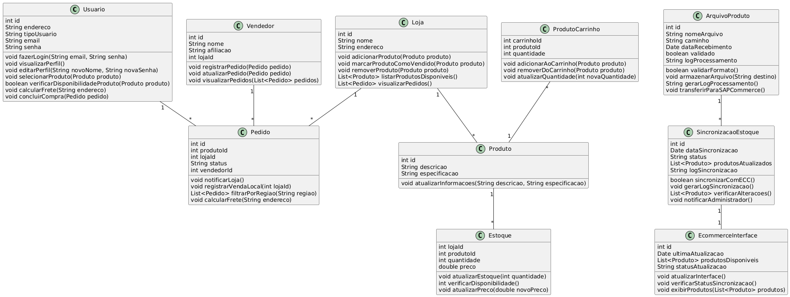
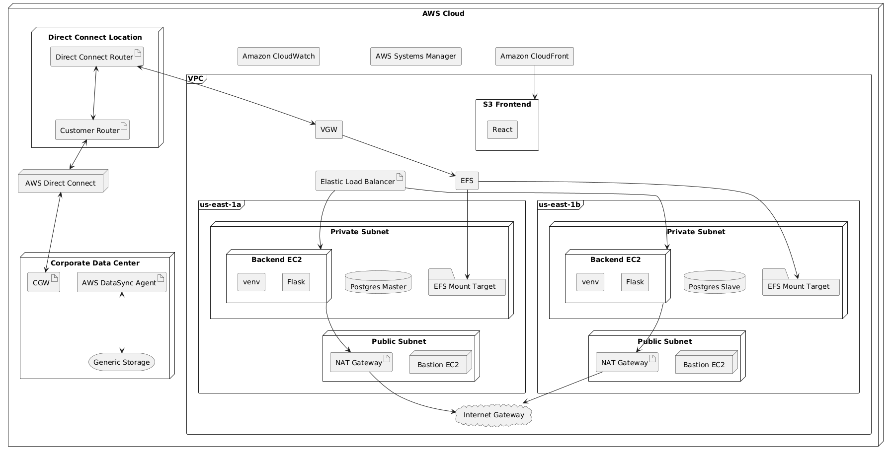
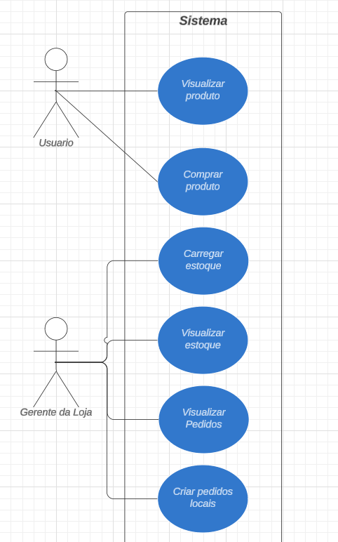
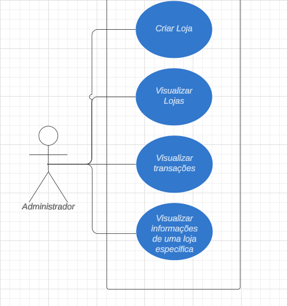

# 1. Diagrama de Classes

## Introdução ao Diagrama UML de Classes

&emsp;O Diagrama UML de Classes é uma representação visual das estruturas estáticas de um sistema, utilizando a Unified Modeling Language (UML). Ele define as classes, seus atributos e métodos, além das relações entre as classes. Esse tipo de diagrama é fundamental para a modelagem orientada a objetos, pois permite que os desenvolvedores compreendam e planejem a arquitetura do software de maneira detalhada e organizada. Ao representar as entidades do sistema e suas interações, o diagrama de classes facilita a comunicação entre membros da equipe de desenvolvimento e garante que todos compartilhem uma visão comum do projeto.

&emsp;No contexto do projeto, o diagrama UML de classes apresentado descreve de forma detalhada as principais entidades envolvidas na simulação dos módulos SAP ECC e SAP Commerce, além do processo de integração entre ambos. Ele ilustra as classes fundamentais como `Usuario`, `Loja`, `Produto`, `Estoque`, entre outras, e define os atributos e métodos necessários para suportar as funcionalidades descritas nos requisitos. As relações entre as classes refletem a interação entre usuários, produtos, lojas e pedidos, assegurando que todas as operações críticas, desde a recepção e validação de arquivos até a sincronização de estoques e a gestão de pedidos, sejam corretamente implementadas.

&emsp;O diagrama UML de classes do projeto da Vivo revela insights cruciais sobre a complexidade e a interdependência das entidades envolvidas, destacando a importância de uma arquitetura bem estruturada para garantir a eficiência das operações. Ele evidencia a centralidade dos processos de sincronização e integração entre os módulos SAP ECC e SAP Commerce, assegurando a consistência dos dados e a atualização adequada das interfaces. Além disso, a inclusão de funcionalidades específicas, como cálculo de frete e registro de pedidos, demonstra um foco detalhado nas necessidades dos usuários, garantindo que o sistema atenda aos requisitos de negócio de maneira eficaz e integrada.

# 2. Diagrama de Sequência

# 3. Diagrama de Implantação

### Introdução ao Diagrama de Implantação

O diagrama de implantação fornecido representa a infraestrutura de um sistema hospedado na AWS (Amazon Web Services). Esse tipo de diagrama é usado para ilustrar a arquitetura física de um sistema, mostrando como diferentes componentes de software e hardware interagem entre si em um ambiente de rede. No contexto de um projeto na AWS, ele ajuda a visualizar como os recursos e serviços são organizados, como eles se comunicam e onde cada serviço está localizado dentro da estrutura da nuvem.

### Componentes e Conexões

1. **AWS Cloud**: A nuvem da AWS é o ambiente de execução principal onde a infraestrutura é implantada. Dentro dela, estão componentes como Amazon CloudWatch, AWS Systems Manager, e Amazon CloudFront, que são usados para monitoramento, gerenciamento e distribuição de conteúdo, respectivamente.

2. **VPC (Virtual Private Cloud)**: A VPC representa uma rede virtual dedicada dentro da nuvem AWS. Ela contém duas sub-redes principais:

   - **Public Subnet**: Sub-redes públicas em cada zona de disponibilidade (`us-east-1a` e `us-east-1b`) hospedam recursos acessíveis externamente, como as instâncias de EC2 (Bastion EC2) e os Gateways NAT (Network Address Translation). Os Bastion EC2 permitem o acesso seguro às sub-redes privadas.

   - **Private Subnet**: Sub-redes privadas em ambas as zonas de disponibilidade contêm instâncias Backend EC2 que hospedam aplicativos Flask executados em ambientes virtuais (venv). Elas também conectam-se a bancos de dados Postgres (Master e Slave) e a pontos de montagem EFS (Elastic File System).

3. **Elastic Load Balancer (ELB)**: O ELB distribui o tráfego de entrada para as instâncias Backend EC2 em ambas as zonas de disponibilidade, garantindo alta disponibilidade e balanceamento de carga para o aplicativo hospedado.

4. **S3 Frontend e Amazon CloudFront**: O componente S3 Frontend é usado para armazenar e servir a camada frontend do sistema (por exemplo, uma aplicação React), enquanto o Amazon CloudFront atua como uma rede de distribuição de conteúdo (CDN) para fornecer o conteúdo de maneira rápida aos usuários finais.

5. **Direct Connect**: Representa uma conexão de rede dedicada entre a infraestrutura local da empresa (Corporate Data Center) e a AWS, proporcionando uma conexão de rede de baixa latência e alta largura de banda. Inclui roteadores como Direct Connect Router e Customer Router para interconectar a rede corporativa com a VPC na AWS.

6. **Corporate Data Center**: Este componente inclui elementos de infraestrutura local, como roteadores CGW (Customer Gateway), um agente AWS DataSync para sincronização de dados, e armazenamento genérico, permitindo integração e migração de dados entre a nuvem e o data center corporativo.

### Conexões e Interações

- **Comunicação dentro da VPC**: Os Backends EC2 nas sub-redes privadas se conectam aos NAT Gateways para acessar serviços na Internet, enquanto os ELBs se conectam aos Backends EC2 para distribuir o tráfego de entrada. EFS é montado em ambas as sub-redes privadas para armazenamento compartilhado.

- **Interconexão da VPC com outras Redes**: O VGW (Virtual Gateway) conecta a VPC com a Direct Connect Location, possibilitando a comunicação entre o ambiente AWS e o Corporate Data Center através de Direct Connect, o que assegura uma conexão segura e estável.

- **Armazenamento e Sincronização de Dados**: O AWS DataSync Agent sincroniza dados entre o armazenamento local no Corporate Data Center e a nuvem AWS, facilitando a transferência de grandes volumes de dados com eficiência e segurança.

Este diagrama de implantação é essencial para entender a arquitetura física do sistema, identificar pontos de falha, otimizar a infraestrutura e assegurar que todos os componentes estejam devidamente integrados para suportar os requisitos do projeto na AWS.

# 4.  Diagrama de Casos de Uso
&emsp;&emsp;O diagrama de casos de uso é um recurso visual para representar a interação entre entes externos ao sistema (atores) com o sistema projetado, destacando as metas e intenções dos atores. Ele é utilizado para facilitar a definição dos requisitos funcionais no sistema, pois, ao representar um fluxo de eventos e conectá-los a atores que interagem com o sistema com um propósito claro, fica mais fácil visualizar as funcionalidades necessárias e quem precisará delas. De maneira geral, como citado anteriormente, temos como elemento deste diagrama a figura do ator, que representa um ente externo, como discutido. Além disso, temos o sistema propriamente dito, que contém dentro de si metas/tarefas a serem executadas e pode possuir ou não associações internas. Também é possível observar uma delimitação clara dos limites do sistema, o que ele propõe a fazer e o que está fora de sua responsabilidade, designado a algum ator secundário. Por exemplo, na compra de algum produto, temos a validação de compra e transação por meio de um banco, e não do sistema de e-commerce. Sendo assim, ele fornece uma visão geral dos usuários e funcionalidades do sistema sem detalhar sequências de ações, mas mostrando as interações com tarefas completas que se tornam requisitos funcionais.

&emsp;&emsp;para o nosso sistema temos 3 tipos de atores, sendo eles usuarios com diferentes objetivos dentro da  plataforma e associados a partes do sistema diferentes, abaixo estão as descrções deles.

- **Atores:**
- 1. **Usuario:** Refere-se ao cliente da vivo que acessa o e-comerce para realizar uma compra ou apenas para visualizar algum produto disponivel no site e suas informações.

- 2. **Gerente de loja:** Refere-se a algum gerente de loja fisica, ou qualquer responsavel por estoque e logistica das lojas fisicas. Ele acessa a plataforma com o objetivo de atualizar o estoque da loja e acompanhar pedidos realizados pelo e-comerce para a loja.

- 3. **Administrador:** Refere-se ao administrador do sistema, cujo objetivo é criar novas lojas físicas e conectá-las ao e-commerce. Além disso, ele também busca monitorar as atualizações feitas no sistema e gerenciar as informações de cada loja, desde o estoque até os pedidos.

&emsp;&emsp;De maneira geral, temos três partes no sistema, e cada uma está direcionada a apenas um tipo de ator. Sendo assim, um ator do tipo usuário não terá acesso às funcionalidades de um administrador e vice-versa, por exemplo. Abaixo está o diagrama de casos de uso desenvolvido pelo grupo para mapear as ações de cada tipo de ator no nosso sistema.

