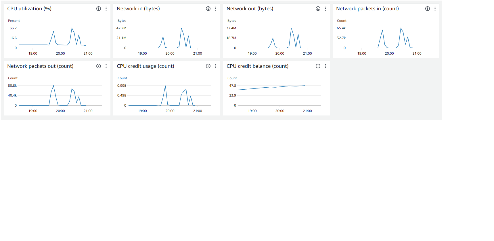
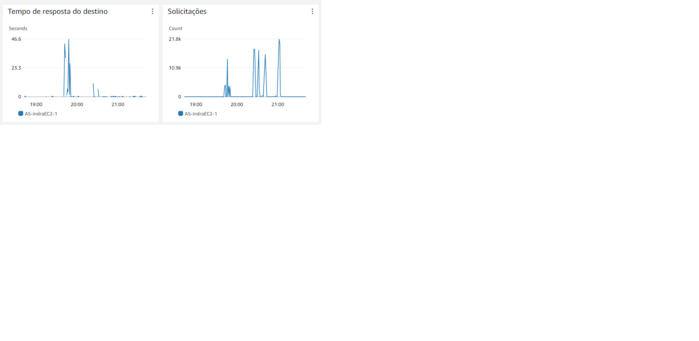

# Teste de Carga com K6 e Auto Scaling na AWS

## Contexto
O teste de carga foi realizado utilizando o pacote [K6](https://k6.io) para JavaScript, visando avaliar a performance de um sistema de e-commerce simulado. O sistema está implementado em instâncias EC2 da AWS, escaladas dinamicamente por um Auto Scaling Group com políticas de **Target Tracking** configuradas para manter a utilização de CPU média em 30%.

A infraestrutura utilizada para o teste consistia de:
- **Load Balancer**: Responsável por distribuir a carga entre as instâncias EC2.
- **Auto Scaling Group**: Configurado para adicionar ou remover instâncias EC2 com base na utilização de CPU.
- **Instância EC2 Inicial**: Servidor web configurado para hospedar o e-commerce simulado.
- **K6**: Utilizado para gerar a carga a partir de outra instância EC2.

## Resultados

### Saída do K6

*Figura 1: Saída do teste de carga utilizando K6, mostrando a execução de 37.444 requisições bem-sucedidas com 3000 usuários virtuais (VUs).*

Neste teste, foram gerados até **3000 usuários virtuais** (VUs) simultâneos durante 4 minutos. O sistema e-commerce foi capaz de atender todas as requisições sem falhas, com **100% de sucesso** (status 200) e uma média de **10.96ms** para o tempo de resposta das requisições HTTP.

### Relatório de Métricas da Instância EC2 Inicial (CloudWatch)

*Figura 2: Gráficos do CloudWatch mostrando a utilização de CPU, tráfego de rede e utilização de créditos de CPU da instância EC2 inicial.*

- **Utilização da CPU**: Atingiu um pico de aproximadamente **33.2%** durante o teste.
- **Tráfego de Rede**:
  - Entrada: **42.2 MB** no pico.
  - Saída: **37.4 MB** no pico.
- **Pacotes de Rede**:
  - Entrada: **65.4k** pacotes no pico.
  - Saída: **80.8k** pacotes no pico.
- **Créditos de CPU**: A média de utilização de créditos de CPU permaneceu estável durante o teste.

Conforme a utilização da CPU da instância inicial atingiu 30%, o **Auto Scaling Group** instanciou uma segunda unidade EC2 para lidar com a carga adicional. A política de escalonamento configurada foi uma **Target Tracking Policy**, que monitora a métrica de utilização da CPU para manter o valor médio em torno de 30%.

### Relatório de Métricas do Load Balancer

*Figura 3: Gráficos do CloudWatch mostrando a utilização de CPU, tráfego de rede e utilização de créditos de CPU do Load Balancer.*
- **Tempo de Resposta do Destino**: O gráfico indica picos de tempo de resposta de até 46,6 segundos em alguns momentos, com uma variação significativa ao longo do tempo. A maioria das respostas, no entanto, ocorre em menos de 10 segundos.
  
- **Solicitações**: Houve um número variável de solicitações ao longo do tempo, com picos significativos que chegam a até 21.8k solicitações. A carga de requisições foi distribuída de forma intermitente, sugerindo períodos de alto tráfego seguidos de intervalos mais calmos.

A distribuição de tráfego foi ajustada de forma a garantir que ambas as instâncias EC2 recebessem carga de forma equilibrada.

## Conclusão
O sistema e-commerce simulado foi capaz de lidar com a carga gerada durante o teste, escalando automaticamente de acordo com o aumento da utilização da CPU. O uso de Auto Scaling e o Load Balancer permitiram que o tráfego fosse distribuído de maneira eficiente, garantindo a disponibilidade e a performance da aplicação sob alta demanda.
